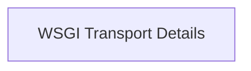

# WSGI Transport Implementation

## Introduction
The `wsgi_transport_implementation` module provides the core components for integrating WSGI (Web Server Gateway Interface) applications directly into HTTPX client requests. This allows HTTPX to communicate with WSGI applications without the need for a separate HTTP server, making it ideal for testing or direct application integration.

## Architecture Overview
This module consists of two main components: `WSGITransport` and `WSGIByteStream`. The `WSGITransport` acts as a bridge, converting an HTTPX `Request` object into a WSGI environment dictionary, invoking the WSGI application, and then transforming the application's response into an HTTPX `Response`. During this process, `WSGIByteStream` is utilized to efficiently stream the byte content generated by the WSGI application, ensuring proper handling of response bodies.

This module is a child of the `transports` module, specializing in WSGI communication, and interacts with other core HTTPX modules such as `models` for Request and Response objects, and `types` for stream handling.

<!-- DIAGRAM_JSON
{
    "direction": "TD",
    "nodes": [
        {"id": "wsgi_transport_details", "label": "WSGI Transport Details", "type": "module", "link": "wsgi_transport_details.md"}
    ],
    "edges": [],
    "groups": []
}
-->

## Module Functionality

### [WSGI Transport Details](wsgi_transport_details.md)
This sub-module encapsulates the logic for establishing a direct connection with a WSGI application. It handles the full lifecycle of a request, from preparing the WSGI environment and executing the WSGI application to processing its output and packaging it into an HTTPX `Response` object. It also manages the efficient streaming of response content using `WSGIByteStream`.