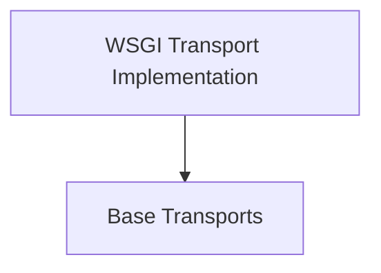

# WSGI Transports Module

## Introduction and Purpose

The `wsgi_transports` module provides a custom transport mechanism for `httpx` that allows sending HTTP requests directly to a [WSGI (Web Server Gateway Interface)](https://wsgi.readthedocs.io/) application. This is particularly useful for testing WSGI applications without needing to run a full HTTP server, or for integrating `httpx` with WSGI-compatible frameworks in a direct, in-process manner.

It enables `httpx` to simulate an HTTP client interacting with a WSGI application by converting `httpx` `Request` objects into a WSGI `environ` dictionary and processing the WSGI application's response.

## Architecture Overview

The `wsgi_transports` module consists of a single sub-module that handles the specifics of WSGI request and response processing. It leverages base transport classes for its core functionality, which are defined in the [base_transports module](base_transports.md).

<!-- DIAGRAM_JSON
{
    "direction": "TD",
    "nodes": [
        {"id": "wsgi_transport_implementation", "label": "WSGI Transport Implementation", "type": "module", "link": "wsgi_transport_implementation.md"},
        {"id": "base_transports", "label": "Base Transports", "type": "external", "link": "base_transports.md"}
    ],
    "edges": [
        {"source": "wsgi_transport_implementation", "target": "base_transports"}
    ],
    "groups": []
}
-->

## Sub-modules

### [WSGI Transport Implementation](wsgi_transport_implementation.md)
This sub-module contains the core classes responsible for handling WSGI requests and responses. It includes `WSGITransport` for interfacing with WSGI applications and `WSGIByteStream` for efficiently handling the byte stream output from WSGI responses.