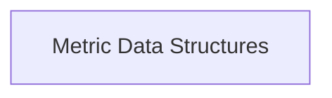

# Aggregator Interfaces and Types Module

## Introduction

The `aggregator_interfaces_and_types` module defines the fundamental data structures and interfaces used across the metric aggregation system. It provides the building blocks for representing metric results and outlines the contract for any component that performs metric aggregation.

## Architecture Overview

This module primarily consists of core data structures and interfaces. It serves as a foundational layer for other modules within the `metric_aggregation` system, establishing the common language for data exchange and aggregation logic. The `metric_data_structures` sub-module encapsulates these core definitions.

<!-- DIAGRAM_JSON
{
    "direction": "TD",
    "nodes": [
        {"id": "metric_data_structures", "label": "Metric Data Structures", "type": "module", "link": "metric_data_structures.md"}
    ],
    "edges": [],
    "groups": []
}
-->

## Sub-modules

- **Metric Data Structures** ([`metric_data_structures.md`](metric_data_structures.md)): This sub-module defines the core data structures and interfaces for handling metric results and aggregation. It includes the `MetricResult` struct and the `MetricAggregator` interface, which are crucial for consistent data representation and operation across the aggregation system.
