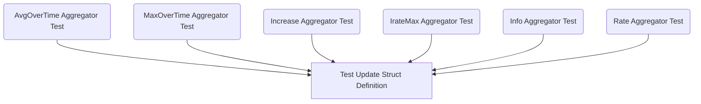

# Module: `aggregator_test_updates`

## Introduction
The `aggregator_test_updates` module is a vital part of the `metric_aggregation`'s `test_helpers` sub-module. Its primary purpose is to define consistent test data structures for simulating metric updates, which are crucial for thoroughly testing various aggregation functions. This module ensures that all aggregator tests utilize a standardized `update` struct, facilitating reliable and maintainable testing practices.

## Core Functionality
This module provides a unified `update` struct used across different metric aggregator test suites. The `update` struct is defined as follows:

```go
	type update struct {
		value                 float64
		timestamp             time.Time
		additionalInformation map[string]string
	}
```

This structure allows tests to simulate incoming metric data with a numerical `value`, an associated `timestamp`, and optional `additionalInformation` in the form of a string map. This consistency is essential for accurately verifying the behavior of aggregation logic, such as `avgovertime`, `maxovertime`, `increase`, `iratemax`, `info`, and `rate`.

## Architecture and Component Relationships

The `aggregator_test_updates` module acts as a foundational testing utility. It defines the common `update` data structure which is then instantiated and utilized by various individual aggregator test files. These tests, in turn, validate the correctness of the corresponding concrete aggregator implementations.

<!-- DIAGRAM_JSON
{
    "direction": "TD",
    "nodes": [
        {"id": "test_update_struct", "label": "Test Update Struct Definition", "type": "component", "link": null},
        {"id": "avgovertime_test", "label": "AvgOverTime Aggregator Test", "type": "external", "link": "metric_aggregation.md"},
        {"id": "maxovertime_test", "label": "MaxOverTime Aggregator Test", "type": "external", "link": "metric_aggregation.md"},
        {"id": "increase_test", "label": "Increase Aggregator Test", "type": "external", "link": "metric_aggregation.md"},
        {"id": "iratemax_test", "label": "IrateMax Aggregator Test", "type": "external", "link": "metric_aggregation.md"},
        {"id": "info_test", "label": "Info Aggregator Test", "type": "external", "link": "metric_aggregation.md"},
        {"id": "rate_test", "label": "Rate Aggregator Test", "type": "external", "link": "metric_aggregation.md"}
    ],
    "edges": [
        {"source": "avgovertime_test", "target": "test_update_struct"},
        {"source": "maxovertime_test", "target": "test_update_struct"},
        {"source": "increase_test", "target": "test_update_struct"},
        {"source": "iratemax_test", "target": "test_update_struct"},
        {"source": "info_test", "target": "test_update_struct"},
        {"source": "rate_test", "target": "test_update_struct"}
    ],
    "groups": []
}
-->


## How it Fits into the Overall System
The `aggregator_test_updates` module is an integral part of the testing infrastructure for the `metric_aggregation` module. It does not directly participate in the runtime metric processing pipeline but is crucial for ensuring the quality, correctness, and reliability of the various metric aggregation functions. By providing a consistent and standardized way to simulate metric updates for testing, it significantly contributes to the robustness of the entire metric collection and analysis system. It specifically supports the testing efforts within the `test_helpers` sub-module of `metric_aggregation`. For more details on the aggregation functions themselves, refer to the [concrete_aggregators.md](concrete_aggregators.md) documentation.
