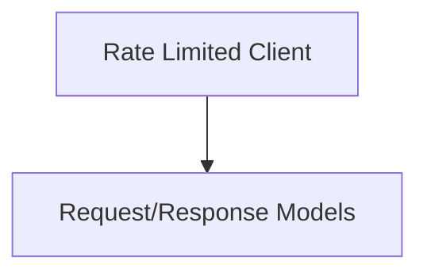

# Client Management Module

## Introduction

The `client_management` module is responsible for handling interactions with the Prometheus API, specifically focusing on rate-limited client operations and the management of requests and responses. It ensures efficient and controlled communication with Prometheus instances.

## Architecture Overview

The module's architecture is centered around a rate-limited Prometheus client that processes work requests and handles responses, taking into account rate limiting and client identification. It is composed of the following key sub-modules:

- **[Rate Limited Client](rate_limited_client.md)**: Manages the core Prometheus client with rate-limiting capabilities and client identification.
- **[Request/Response Models](request_response_models.md)**: Defines the data structures used for handling work requests and their corresponding rate-limited responses within the Prometheus client.

<!-- DIAGRAM_JSON
{
    "direction": "TD",
    "nodes": [
        {"id": "rate_limited_client", "label": "Rate Limited Client", "type": "module", "link": "rate_limited_client.md"},
        {"id": "request_response_models", "label": "Request/Response Models", "type": "module", "link": "request_response_models.md"}
    ],
    "edges": [
        {"source": "rate_limited_client", "target": "request_response_models"}
    ],
    "groups": []
}
-->

