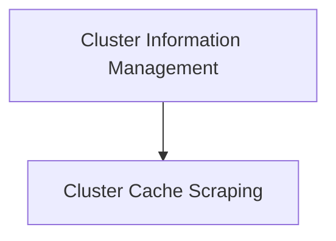

# Cluster Data Module Documentation

## Introduction

The `cluster_data` module is a core component within the `collector_scraping` system, responsible for gathering and managing essential information about Kubernetes clusters. It provides mechanisms for scraping cluster-specific data, caching it for performance, and maintaining a high-level overview of registered clusters.

## Architecture Overview

The `cluster_data` module is structured to efficiently collect and store cluster-related metrics and metadata. It interacts with underlying cluster caches and information providers to ensure up-to-date insights into the cluster's state. The module is composed of two primary sub-modules:

*   **Cluster Cache Scraping**: Focuses on the mechanisms for fetching and storing dynamic cluster data.
*   **Cluster Information Management**: Deals with the static and foundational information about the clusters.

<!-- DIAGRAM_JSON
{
    "direction": "TD",
    "nodes": [
        {"id": "cluster_cache_scraping", "label": "Cluster Cache Scraping", "type": "module", "link": "cluster_cache_scraping.md"},
        {"id": "cluster_information_management", "label": "Cluster Information Management", "type": "module", "link": "cluster_information_management.md"}
    ],
    "edges": [
        {"source": "cluster_information_management", "target": "cluster_cache_scraping"}
    ],
    "groups": []
}
-->

## Sub-modules

### [Cluster Cache Scraping](cluster_cache_scraping.md)
This sub-module is responsible for the active collection and maintenance of various cluster data points, such as resource quotas. It includes the `ClusterCacheScraper` which interfaces with a `clustercache.ClusterCache` to retrieve and update cached cluster information.

### [Cluster Information Management](cluster_information_management.md)
This sub-module handles the fundamental aspects of identifying and managing cluster metadata. It comprises components like `ClusterInfoScrapper`, which provides the cluster's unique identifier, and `collectorClusterMap`, which maintains a mapping of cluster information for the collector system.
