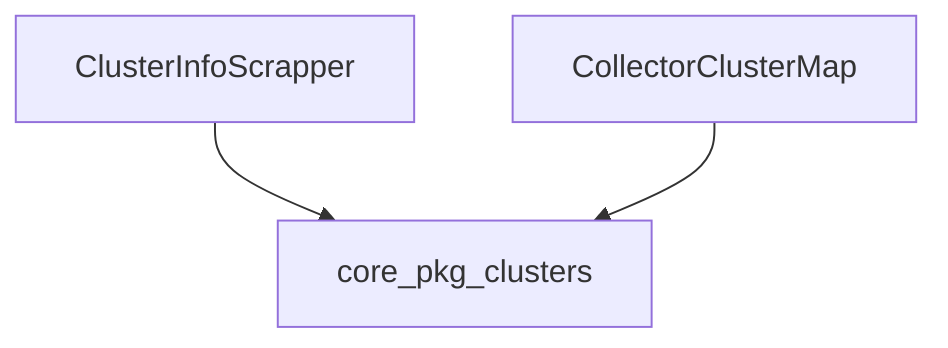

# cluster_information_management Module Documentation

## Introduction

The `cluster_information_management` module is a vital part of the `collector_scraping` subsystem. Its primary responsibility is to manage and provide crucial information about the clusters being monitored. This includes details necessary for effective data collection and mapping within the system.

## Comprehensive Documentation

### Purpose and Core Functionality

This module serves as the central point for obtaining and organizing cluster-specific metadata. It provides mechanisms for scraping cluster information and maintaining a mapped view of these clusters, ensuring that other components requiring cluster context have access to up-to-date and consistent data.

### Architecture and Component Relationships

The `cluster_information_management` module contains two core components: `ClusterInfoScrapper` and `collectorClusterMap`. Both components rely heavily on the `ClusterInfoProvider` interface, which is defined and implemented within the [core_pkg_clusters](core_pkg_clusters.md) module. This establishes a clear dependency on the core cluster management functionalities.

*   **`ClusterInfoScrapper`**: This component is responsible for actively retrieving or "scraping" information about a specific cluster, identified by its unique ID (`clusterUID`). It leverages the `ClusterInfoProvider` to fetch the necessary details, acting as an abstraction layer over the actual data source.
    ```go
type ClusterInfoScrapper struct {
	clusterUID          string
	clusterInfoProvider clusters.ClusterInfoProvider
}
    ```

*   **`collectorClusterMap`**: This component provides a mapping or organized view of cluster information. It uses the `ClusterInfoProvider` to access and potentially cache or structure the data provided by the core cluster services, making it readily available for other parts of the collector.
    ```go
type collectorClusterMap struct {
	clusterInfo clusters.ClusterInfoProvider
}
    ```

The relationship highlights that `cluster_information_management` acts as an intermediary, using the generic `ClusterInfoProvider` from `core_pkg_clusters` to build specialized tools (`ClusterInfoScrapper`, `collectorClusterMap`) for the `collector_scraping` process.

### How the Module Fits into the Overall System

The `cluster_information_management` module is integral to the data collection pipeline, specifically within the `collector_scraping` process. It provides the foundational cluster metadata that enables scrapers to correctly identify and categorize the data they collect. By abstracting the details of cluster information retrieval through `ClusterInfoProvider`, it ensures that the scraping logic remains decoupled from the specifics of how cluster information is stored or sourced. This module's output directly feeds into other scraping and data processing components, ensuring data is attributed to the correct clusters and contexts.

<!-- DIAGRAM_JSON
{
    "direction": "TD",
    "nodes": [
        {"id": "cluster_info_scrapper", "label": "ClusterInfoScrapper", "type": "component", "link": null},
        {"id": "collector_cluster_map", "label": "CollectorClusterMap", "type": "component", "link": null},
        {"id": "core_pkg_clusters", "label": "core_pkg_clusters", "type": "external", "link": "core_pkg_clusters.md"}
    ],
    "edges": [
        {"source": "cluster_info_scrapper", "target": "core_pkg_clusters"},
        {"source": "collector_cluster_map", "target": "core_pkg_clusters"}
    ],
    "groups": []
}
-->
