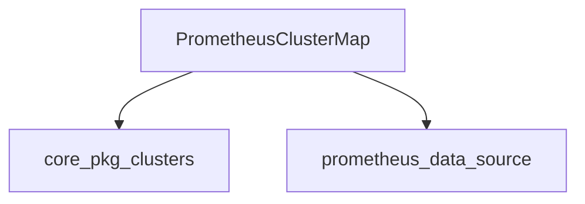

# `cluster_mapping` Module Documentation

The `cluster_mapping` module is an integral part of the `prometheus_integration` within the overall system. Its primary role is to manage and provide a mapping of cluster information, enabling the Prometheus integration to correctly associate collected metrics with their respective Kubernetes clusters. This module acts as a bridge, translating raw data and context from Prometheus into structured cluster insights.

### Purpose and Core Functionality

The `cluster_mapping` module is designed to maintain an up-to-date representation of clusters based on information gathered or inferred during Prometheus metric collection. Its core functionality revolves around the `PrometheusClusterMap` component, which serves as the central data structure for storing and managing cluster-related metadata.

The `PrometheusClusterMap` component:
*   **Maintains Cluster Information:** Stores a mapping of cluster identifiers to detailed `ClusterInfo` objects, providing comprehensive data about each cluster.
*   **Ensures Concurrency Safety:** Utilizes `sync.RWMutex` to guarantee thread-safe access to the internal cluster map, preventing race conditions in concurrent environments.
*   **Leverages Context Factory:** Employs a `ContextFactory` to generate appropriate contexts for data operations, which might involve fetching or inferring cluster details from various sources within the Prometheus ecosystem.
*   **Abstracts Cluster Information Provision:** Depends on a `ClusterInfoProvider` interface to abstract the method of retrieving or generating `ClusterInfo`, allowing for flexible and extensible information sources.
*   **Manages Lifecycle:** Includes a `stop` channel to facilitate graceful shutdown and resource cleanup.

### Architecture and Component Relationships

The `cluster_mapping` module, through its `PrometheusClusterMap` component, orchestrates the collection and management of cluster information. It primarily interacts with external modules for both data provision and foundational cluster definitions.

<!-- DIAGRAM_JSON
{
    "direction": "TD",
    "nodes": [
        {"id": "prometheus_cluster_map", "label": "PrometheusClusterMap", "type": "component", "link": null},
        {"id": "core_pkg_clusters", "label": "core_pkg_clusters", "type": "external", "link": "core_pkg_clusters.md"},
        {"id": "prometheus_data_source", "label": "prometheus_data_source", "type": "external", "link": "prometheus_data_source.md"}
    ],
    "edges": [
        {"source": "prometheus_cluster_map", "target": "core_pkg_clusters"},
        {"source": "prometheus_cluster_map", "target": "prometheus_data_source"}
    ],
    "groups": []
}
-->

**Key Relationships:**
*   **`PrometheusClusterMap`** (Internal Component): This is the central component within the `cluster_mapping` module. It holds the logic and data structures for maintaining the cluster mappings.
*   **`core_pkg_clusters`** (External Dependency): The `PrometheusClusterMap` relies heavily on the `core_pkg_clusters` module for fundamental definitions such as `clusters.ClusterInfo` and the `clusters.ClusterInfoProvider` interface. This ensures consistency in how cluster information is represented across the system.
*   **`prometheus_data_source`** (External Dependency): The `ContextFactory` utilized by `PrometheusClusterMap` is likely provided or managed by the `prometheus_data_source` module. This module, a sibling within `data_source_and_configuration`, is responsible for integrating with Prometheus and would thus provide the necessary context for identifying and mapping clusters from Prometheus scrape targets.

### How it Fits into the Overall System

The `cluster_mapping` module plays a critical role in the overall system by providing the necessary contextual information for Prometheus-sourced metrics. Without accurate cluster mapping, it would be impossible to correctly attribute resource usage, costs, or performance metrics to specific clusters.

*   **Enables Metric Attribution:** It allows `prometheus_integration` to enrich collected metrics with cluster-specific labels or metadata, crucial for filtering, aggregation, and visualization in other parts of the system (e.g., `pkg_metrics`, `pkg_costmodel`).
*   **Supports Cost Allocation:** By linking metrics to clusters, it directly supports cost allocation and reporting functionalities provided by modules like `pkg_cloudcost` and `pkg_costmodel`, ensuring that cloud spending can be accurately tracked per cluster.
*   **Facilitates Monitoring and Diagnostics:** Other modules responsible for monitoring and diagnostics can leverage the cluster map to gain insights into the health and performance of individual clusters.
*   **Part of Data Ingestion Pipeline:** It's an essential step in the data ingestion pipeline for Prometheus, ensuring that raw data is transformed into meaningful, cluster-aware information before further processing.