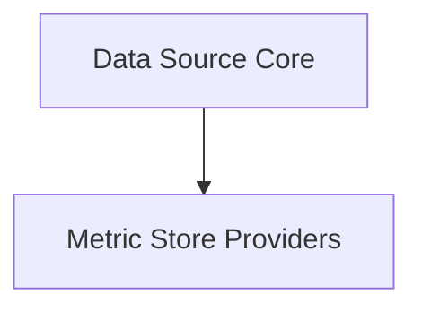

# Collector Data Providers Module

The `collector_data_providers` module is responsible for abstracting the various sources of data that the collector utilizes. It provides core components for gathering metrics, cluster information, and diagnostics, as well as managing metric storage through different provider implementations.

## Architecture

The module is structured into key components that manage data sourcing and storage. The `data_source_core` component acts as the central orchestrator for data collection, interacting with external systems for metrics and cluster data. The `metric_store_providers` component handles the persistence and retrieval of collected metrics.

<!-- DIAGRAM_JSON
{
    "direction": "TD",
    "nodes": [
        {"id": "data_source_core", "label": "Data Source Core", "type": "module", "link": "data_source_core.md"},
        {"id": "metric_store_providers", "label": "Metric Store Providers", "type": "module", "link": "metric_store_providers.md"}
    ],
    "edges": [
        {"source": "data_source_core", "target": "metric_store_providers"}
    ],
    "groups": []
}
-->

## Sub-modules

### [Data Source Core](data_source_core.md)
Manages the primary data collection from metrics, cluster information, and diagnostic modules.

### [Metric Store Providers](metric_store_providers.md)
Provides interfaces for accessing and managing metric data storage, including repository-backed and mock implementations.
