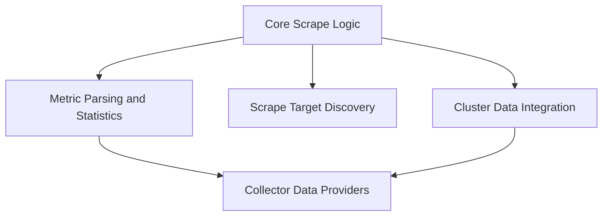

# Collector Scraping Module Documentation

## Introduction

The `collector_scraping` module is a critical component responsible for actively collecting and processing metrics from various sources within the system. It orchestrates the discovery of scrape targets, manages the scraping process, parses raw metric data, and integrates with the overall collector framework for data storage and retrieval. This module ensures that up-to-date operational data is continuously fed into the system for monitoring, analysis, and reporting.

## Architecture Overview

The `collector_scraping` module is structured into several sub-modules, each handling a specific aspect of the scraping and data collection process. The architecture is designed for modularity, allowing for flexible extension and maintenance of different scraping mechanisms and data providers.

<!-- DIAGRAM_JSON
{
    "direction": "TD",
    "nodes": [
        {"id": "scrape_core", "label": "Core Scrape Logic", "type": "module", "link": "scrape_core.md"},
        {"id": "cluster_data", "label": "Cluster Data Integration", "type": "module", "link": "cluster_data.md"},
        {"id": "target_discovery", "label": "Scrape Target Discovery", "type": "module", "link": "target_discovery.md"},
        {"id": "metric_parsing_and_stats", "label": "Metric Parsing and Statistics", "type": "module", "link": "metric_parsing_and_stats.md"},
        {"id": "collector_data_providers", "label": "Collector Data Providers", "type": "module", "link": "collector_data_providers.md"}
    ],
    "edges": [
        {"source": "scrape_core", "target": "cluster_data"},
        {"source": "scrape_core", "target": "target_discovery"},
        {"source": "scrape_core", "target": "metric_parsing_and_stats"},
        {"source": "metric_parsing_and_stats", "target": "collector_data_providers"},
        {"source": "cluster_data", "target": "collector_data_providers"}
    ],
    "groups": []
}
-->

## Sub-modules and their Functionality

Here's a breakdown of the key sub-modules within `collector_scraping`:

*   **[Core Scrape Logic (scrape_core.md)](scrape_core.md)**
    This module manages the central scraping process, including the scrape controller and event handling for scrapes.

*   **[Cluster Data Integration (cluster_data.md)](cluster_data.md)**
    This module handles integration with cluster cache and provides cluster-specific information for scraping operations.

*   **[Scrape Target Discovery (target_discovery.md)](target_discovery.md)**
    This module is responsible for identifying and providing various targets for metric scraping, such as network and DCGM targets.

*   **[Metric Parsing and Statistics (metric_parsing_and_stats.md)](metric_parsing_and_stats.md)**
    This module manages the parsing of raw metric data into structured records and handles the collection and processing of statistical summaries.

*   **[Collector Data Providers (collector_data_providers.md)](collector_data_providers.md)**
    This module provides interfaces and implementations for data sources and metric storage within the collector framework, enabling data retrieval and persistence.
