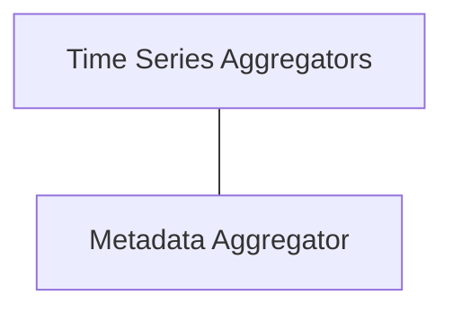

# Concrete Aggregators Module

## Introduction and Purpose

The `concrete_aggregators` module provides a collection of specific aggregation implementations used for processing and summarizing metric data within the system. These aggregators are fundamental for transforming raw metric observations into meaningful insights, supporting various analytical and reporting functionalities.

## Architecture Overview

This module acts as a crucial component within the `metric_aggregation` system, offering the core logic for different types of data aggregation. It relies on the broader `metric_aggregation` module for interfaces and types, ensuring consistency and extensibility. The aggregators within this module process incoming metric data, maintaining state to calculate aggregated values over time or to store informational metadata.

<!-- DIAGRAM_JSON
{
    "direction": "TD",
    "nodes": [
        {"id": "time_series_aggregators", "label": "Time Series Aggregators", "type": "module", "link": "time_series_aggregators.md"},
        {"id": "metadata_aggregator", "label": "Metadata Aggregator", "type": "module", "link": "metadata_aggregator.md"}
    ],
    "edges": [
        {"source": "time_series_aggregators", "target": "metadata_aggregator", "label": "can operate alongside"}
    ],
    "groups": []
}
-->

## Sub-modules

### [Time Series Aggregators](time_series_aggregators.md)
This sub-module encapsulates various aggregators designed for processing metric data over time. It includes functionalities to calculate averages, maximums, rates of change, increases, and uptime, providing a comprehensive set of tools for temporal data analysis.

### [Metadata Aggregator](metadata_aggregator.md)
The `metadata_aggregator` sub-module focuses on collecting and storing additional, non-numeric informational labels associated with metrics. This is essential for providing context and richer detail to aggregated metric data, allowing for better identification and categorization.
