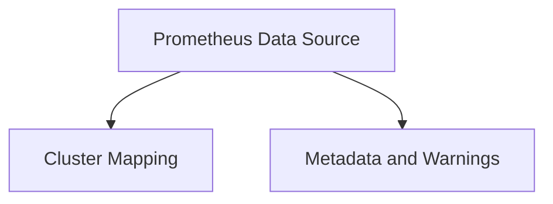

# Data Source and Configuration Module

## Introduction
The `data_source_and_configuration` module is a crucial component within the `prometheus_integration` system, responsible for establishing and managing the connection to Prometheus data sources. It provides the necessary structures and logic to configure Prometheus, map clusters, and handle metadata and warnings related to the data ingestion process. This module ensures that the Prometheus integration can effectively collect and process metric data.

## Architecture Overview
The module is structured into three main sub-modules: `prometheus_data_source`, `cluster_mapping`, and `metadata_and_warnings`. These sub-modules work in conjunction to provide a robust framework for Prometheus data handling.

<!-- DIAGRAM_JSON
{
    "direction": "TD",
    "nodes": [
        {"id": "prometheus_data_source", "label": "Prometheus Data Source", "type": "module", "link": "prometheus_data_source.md"},
        {"id": "cluster_mapping", "label": "Cluster Mapping", "type": "module", "link": "cluster_mapping.md"},
        {"id": "metadata_and_warnings", "label": "Metadata and Warnings", "type": "module", "link": "metadata_and_warnings.md"}
    ],
    "edges": [
        {"source": "prometheus_data_source", "target": "cluster_mapping"},
        {"source": "prometheus_data_source", "target": "metadata_and_warnings"}
    ],
    "groups": []
}
-->

## Sub-modules

### [Prometheus Data Source](prometheus_data_source.md)
This sub-module is responsible for the core integration with Prometheus. It defines the main `PrometheusDataSource` structure, which encapsulates the Prometheus configuration, client, metrics querier, and cluster information. It also includes the `PrometheusConfig` component, which outlines the expected structure for Prometheus scrape configurations.

### [Cluster Mapping](cluster_mapping.md)
The `cluster_mapping` sub-module focuses on managing the association between different clusters and their Prometheus contexts. The `PrometheusClusterMap` component within this module handles the locking mechanisms, context factory, and storage of cluster information, ensuring accurate mapping for data retrieval.

### [Metadata and Warnings](metadata_and_warnings.md)
This sub-module deals with the operational metadata and warning mechanisms for the Prometheus integration. It includes `PrometheusMetadata` for reporting the running status and data existence, and defines a `warning` interface along with a `defaultWarning` implementation to provide insights into potential issues during data collection or processing.
