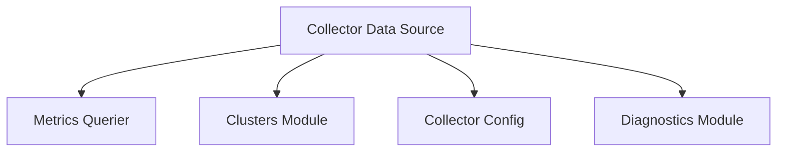

# data_source_core

## Introduction
The `data_source_core` module is a fundamental component within the `collector_scraping` system, specifically residing under `collector_data_providers`. Its primary responsibility is to provide and manage the core data required for the collector to operate, including metric querying capabilities, cluster information, and configuration management. This module acts as an abstraction layer, supplying essential data interfaces to other parts of the collector.

## Architecture and Component Relationships

The `data_source_core` module's architecture is centered around the `collectorDataSource` component, which orchestrates interactions with various internal and external dependencies to fulfill its data provisioning role.

<!-- DIAGRAM_JSON
{
    "direction": "TD",
    "nodes": [
        {"id": "collector_data_source", "label": "Collector Data Source", "type": "component", "link": null},
        {"id": "metrics_querier", "label": "Metrics Querier", "type": "component", "link": null},
        {"id": "collector_config", "label": "Collector Config", "type": "component", "link": null},
        {"id": "clusters", "label": "Clusters Module", "type": "external", "link": "core_pkg_clusters.md"},
        {"id": "diagnostics", "label": "Diagnostics Module", "type": "external", "link": "core_pkg_diagnostics.md"}
    ],
    "edges": [
        {"source": "collector_data_source", "target": "metrics_querier"},
        {"source": "collector_data_source", "target": "clusters"},
        {"source": "collector_data_source", "target": "collector_config"},
        {"source": "collector_data_source", "target": "diagnostics"}
    ],
    "groups": []
}
-->

### Core Components

#### `collectorDataSource`
The `collectorDataSource` struct is the central component of this module. It encapsulates the necessary interfaces and configurations to provide data.

*   **`metricsQuerier`**: An internal component responsible for querying and retrieving metrics. It acts as the primary interface for fetching performance and usage data.
*   **`clusterMap`** and **`clusterInfo`**: These fields leverage the `clusters` module to access and manage cluster-related information, such as cluster topology, node details, and other relevant metadata. For more details, refer to the [core_pkg_clusters module documentation](core_pkg_clusters.md).
*   **`config`**: Stores the `CollectorConfig`, which defines the operational parameters and settings for the data collection process. This configuration guides how metrics are queried and processed.
*   **`diagnosticsModule`**: Integrates with a diagnostics module to report operational health, errors, and other diagnostic information, crucial for monitoring and troubleshooting. For more details, refer to the [core_pkg_diagnostics module documentation](core_pkg_diagnostics.md).

## System Integration
The `data_source_core` module is a sub-module of `collector_data_providers`, which in turn is part of the `collector_scraping` module. Its role is critical in providing the foundational data layers for the scraping process. It abstracts the complexities of metric querying, cluster information retrieval, and configuration management, allowing higher-level collector components to focus on data processing and aggregation.

This module ensures that the `collector_scraping` process has consistent and reliable access to:
*   Up-to-date metrics from various sources via `metricsQuerier`.
*   Comprehensive cluster topology and metadata through the `clusters` module.
*   Operational parameters and settings via `CollectorConfig`.
*   A mechanism for reporting and logging diagnostic information.

By centralizing these data provisioning concerns, `data_source_core` enhances the modularity and maintainability of the overall `collector_scraping` system.
