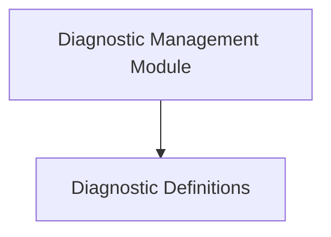

# Diagnostic Collection Module

The `diagnostic_collection` module is responsible for defining, collecting, and managing various diagnostics throughout the system. It provides mechanisms to gather insights into the system's operational health and performance, particularly concerning metric scraping processes.

## Architecture Overview

This module is structured into key sub-modules that handle diagnostic definitions and their overall management.

<!-- DIAGRAM_JSON
{
    "direction": "TD",
    "nodes": [
        {"id": "diagnostic_definitions", "label": "Diagnostic Definitions", "type": "module", "link": "diagnostic_definitions.md"},
        {"id": "diagnostic_management", "label": "Diagnostic Management Module", "type": "module", "link": "diagnostic_management.md"}
    ],
    "edges": [
        {"source": "diagnostic_management", "target": "diagnostic_definitions"}
    ],
    "groups": []
}
-->

## Sub-modules

### [Diagnostic Definitions](diagnostic_definitions.md)
This sub-module focuses on the core interfaces and data structures used to define different types of diagnostics. It includes generic diagnostic interfaces and specific implementations for capturing details related to metric scraping.

### [Diagnostic Management Module](diagnostic_management.md)
This sub-module is responsible for the overall management of diagnostic instances. It handles the registration, retrieval, and lifecycle of `CollectorDiagnostic` objects, ensuring that diagnostic data can be effectively collected and utilized across the system.
