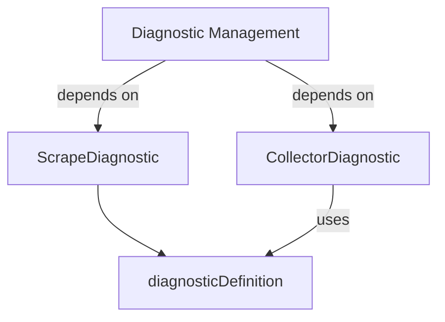

# `diagnostic_definitions` Module Documentation

## Introduction

The `diagnostic_definitions` module, located within `modules/utilities_diagnostics/diagnostic_collection`, is responsible for establishing the foundational data structures and interfaces used across the system for diagnostic reporting, particularly in the context of metric collection. It provides a standardized mechanism to define, describe, and encapsulate diagnostic information, ensuring consistency in how diagnostic data is generated and consumed.

## Core Functionality and Purpose

This module serves as the central hub for defining the "what" and "how" of diagnostics in metric collection. Its core functionalities include:

*   **Defining Diagnostic Metadata**: Through `diagnosticDefinition`, it provides a comprehensive structure for metadata associated with any diagnostic, including its unique identifier, metric name, user-friendly label, detailed description, and a link to further documentation.
*   **Standardizing Diagnostic Behavior**: The `CollectorDiagnostic` interface enforces a contract for all diagnostic implementations, ensuring that they can provide an ID, a name, and detailed information about their state or findings.
*   **Capturing Scrape-Specific Diagnostics**: The `scrapeDiagnostic` structure is tailored to hold specific diagnostic outcomes related to individual data scraping operations, consolidating information about the scraper, the type of scrape, the number of targets involved, and any errors encountered.

By centralizing these definitions, the module facilitates uniform diagnostic reporting, making it easier for developers and operators to understand, debug, and monitor the health and performance of metric collection processes.

## Architecture and Component Relationships

The `diagnostic_definitions` module comprises key components that work together to provide a robust diagnostic framework:

*   **`diagnosticDefinition`**: This is the fundamental data structure that holds all descriptive metadata for any diagnostic. It serves as a blueprint for identifying and explaining what a particular diagnostic represents.
*   **`CollectorDiagnostic`**: An interface that outlines the expected behavior for any component acting as a diagnostic reporter within the metric collection system. Implementations of this interface will typically leverage the information defined in `diagnosticDefinition` to fulfill their contractual obligations (e.g., returning an ID and Name).
*   **`scrapeDiagnostic`**: This struct is a concrete manifestation of a diagnostic result, specifically for data scraping operations. It encapsulates operational details of a scrape alongside a reference to its `diagnosticDefinition`, allowing for detailed post-mortem analysis of scrape events.

These components form a clear hierarchy where `diagnosticDefinition` provides the static description, `CollectorDiagnostic` defines the dynamic reporting interface, and `scrapeDiagnostic` captures specific runtime instances of diagnostic findings during scraping.

## How the Module Fits into the Overall System

The `diagnostic_definitions` module is a critical dependency for any part of the system that needs to generate, report, or consume diagnostic information related to metric collection. It acts as a foundational layer within the `utilities_diagnostics.diagnostic_collection` sub-system.

It primarily supports:

*   **`diagnostic_management`**: This related module (likely `modules.utilities_diagnostics.diagnostic_collection.diagnostic_management`) would interact directly with the definitions provided here to aggregate, store, and expose diagnostic data through various interfaces or APIs. It relies on the consistent structures defined in `diagnostic_definitions` to process and present diagnostic reports.
*   **Metric Collectors and Scrapers**: Components responsible for actively collecting metrics from various sources would use the `CollectorDiagnostic` interface to report their status and `scrapeDiagnostic` to log detailed outcomes of their operations.

By providing a common language and structure for diagnostics, this module ensures that operational insights are consistently formatted and easily interpretable across different parts of the system, enhancing observability and maintainability.

<!-- DIAGRAM_JSON
{
    "direction": "TD",
    "nodes": [
        {"id": "collector_diagnostic", "label": "CollectorDiagnostic", "type": "component", "link": null},
        {"id": "scrape_diagnostic", "label": "ScrapeDiagnostic", "type": "component", "link": null},
        {"id": "diagnostic_definition", "label": "diagnosticDefinition", "type": "component", "link": null},
        {"id": "diagnostic_management", "label": "Diagnostic Management", "type": "external", "link": "diagnostic_management.md"}
    ],
    "edges": [
        {"source": "scrape_diagnostic", "target": "diagnostic_definition"},
        {"source": "collector_diagnostic", "target": "diagnostic_definition", "label": "uses"},
        {"source": "diagnostic_management", "target": "collector_diagnostic", "label": "depends on"},
        {"source": "diagnostic_management", "target": "scrape_diagnostic", "label": "depends on"}
    ],
    "groups": []
}
-->

