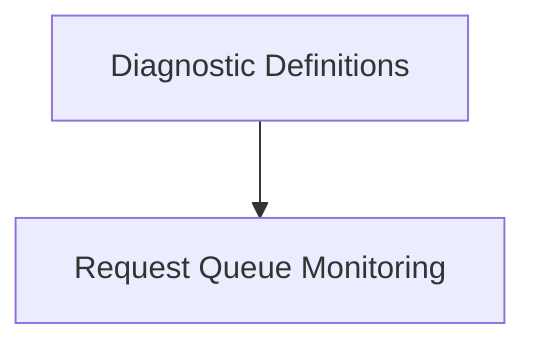

# Diagnostics and Monitoring Module

## Introduction
The `diagnostics_and_monitoring` module provides essential functionalities for assessing the health and performance of the Prometheus integration. It defines structures for diagnostic checks and monitors the state of Prometheus requests, ensuring efficient and reliable data collection. This module is a core part of the `prometheus_integration` module, offering insights into its operational status and potential issues.

## Architecture Overview
The `diagnostics_and_monitoring` module is composed of two primary sub-modules: `diagnostic_definitions` and `request_queue_monitoring`. These sub-modules work together to provide comprehensive insights into the Prometheus data source's operational status.

<!-- DIAGRAM_JSON
{
    "direction": "TD",
    "nodes": [
        {"id": "diagnostic_definitions", "label": "Diagnostic Definitions", "type": "module", "link": "diagnostic_definitions.md"},
        {"id": "request_queue_monitoring", "label": "Request Queue Monitoring", "type": "module", "link": "request_queue_monitoring.md"}
    ],
    "edges": [
        {"source": "diagnostic_definitions", "target": "request_queue_monitoring", "label": "utilizes"}
    ],
    "groups": []
}
-->

## Sub-modules

### [Diagnostic Definitions](diagnostic_definitions.md)
This sub-module is responsible for defining the structure and content of various diagnostic checks performed within the system. It encompasses the definition of queries, labels, descriptions, and the storage of diagnostic results.

### [Request Queue Monitoring](request_queue_monitoring.md)
The `request_queue_monitoring` sub-module focuses on tracking and managing the state of Prometheus requests. It provides visibility into queued, outbound, and total requests, along with managing query concurrency to optimize performance and prevent overload.
