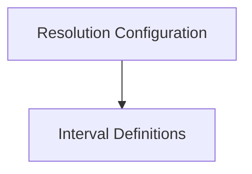

# interval_and_resolution Module Documentation

## Introduction
The `interval_and_resolution` module is responsible for defining and managing time intervals and data resolution configurations. It provides core structures for specifying how data should be aggregated and retained over different timeframes, crucial for metrics collection and reporting within the system.

## Architecture Overview
The `interval_and_resolution` module is composed of two primary sub-modules: `resolution_configuration` which handles the overall settings for data resolution, and `interval_definitions` which provides the fundamental interval types used throughout the system. These sub-modules work in conjunction to ensure consistent and configurable time-based data processing.

<!-- DIAGRAM_JSON
{
    "direction": "TD",
    "nodes": [
        {"id": "resolution_configuration", "label": "Resolution Configuration", "type": "module", "link": "resolution_configuration.md"},
        {"id": "interval_definitions", "label": "Interval Definitions", "type": "module", "link": "interval_definitions.md"}
    ],
    "edges": [
        {"source": "resolution_configuration", "target": "interval_definitions"}
    ],
    "groups": []
}
-->

## Sub-modules

*   **[Resolution Configuration](resolution_configuration.md)**: This sub-module defines the `ResolutionConfiguration` structure, which dictates the interval and retention policies for various data metrics. It is critical for establishing how historical data is stored and processed.

*   **[Interval Definitions](interval_definitions.md)**: This sub-module provides the concrete implementations of time intervals, such as `weekInterval` and `durationInterval`, and also includes testing utilities for these interval types. These definitions are foundational for any time-series data operations.
