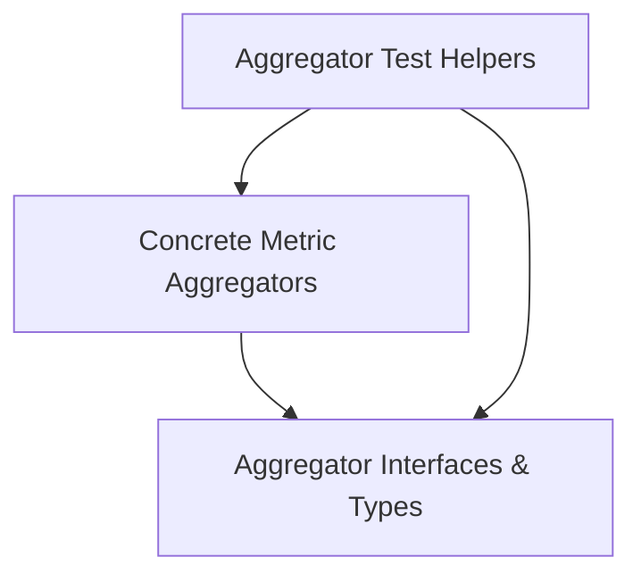

# Metric Aggregation Module

## Introduction
The `metric_aggregation` module is responsible for defining and implementing various strategies for aggregating metrics. It provides interfaces for common aggregation patterns and concrete implementations for calculating values like averages over time, maximums, rates of increase, and uptime. This module is a core component for processing raw metric data into meaningful, summarized forms.

## Architecture Overview

The `metric_aggregation` module is structured into several key sub-modules that work together to provide a robust metric aggregation system. These sub-modules define the fundamental interfaces, provide concrete implementations of various aggregation logic, and include utilities for testing these aggregators.

<!-- DIAGRAM_JSON
{
    "direction": "TD",
    "nodes": [
        {"id": "aggregator_interfaces_and_types", "label": "Aggregator Interfaces & Types", "type": "module", "link": "aggregator_interfaces_and_types.md"},
        {"id": "concrete_aggregators", "label": "Concrete Metric Aggregators", "type": "module", "link": "concrete_aggregators.md"},
        {"id": "test_helpers", "label": "Aggregator Test Helpers", "type": "module", "link": "test_helpers.md"}
    ],
    "edges": [
        {"source": "concrete_aggregators", "target": "aggregator_interfaces_and_types"},
        {"source": "test_helpers", "target": "aggregator_interfaces_and_types"},
        {"source": "test_helpers", "target": "concrete_aggregators"}
    ],
    "groups": []
}
-->

## Sub-modules

### [Aggregator Interfaces & Types](aggregator_interfaces_and_types.md)
This sub-module defines the fundamental `MetricAggregator` interface that all aggregators must implement, ensuring a consistent contract for metric processing. It also includes the `MetricResult` structure, which standardizes the output format for aggregated metrics.

### [Concrete Metric Aggregators](concrete_aggregators.md)
This sub-module contains the actual implementations of various metric aggregation algorithms. It includes aggregators for common patterns such as `averageOverTimeAggregator`, `maxOverTimeAggregator`, `increaseAggregator`, `iRateMaxAggregator`, `infoAggregator`, `rateAggregator`, and `uptimeAggregator`, each designed to calculate specific metric insights.

### [Aggregator Test Helpers](test_helpers.md)
This sub-module provides helper data structures and utilities specifically designed to facilitate the testing of the metric aggregators. These components streamline the creation of test scenarios and validation of aggregation logic.
