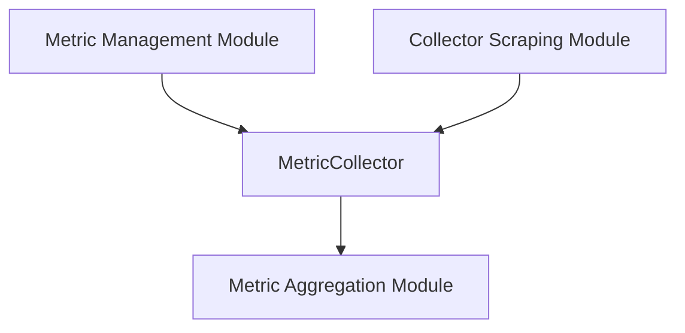

# Metric Collection Module

The `metric_collection` module is a core component within the metric management system, primarily responsible for the active gathering, filtering, and initial aggregation of various system metrics. It acts as the initial point of entry for raw metric data before further processing and storage.

## Purpose and Core Functionality

The primary purpose of the `metric_collection` module is to provide a structured way to collect specific metrics, apply filtering rules, and prepare them for aggregation. At its heart is the `MetricCollector` component.

### MetricCollector

The `MetricCollector` struct defines the fundamental properties and operations for a single metric collection stream. It encapsulates the logic for identifying, filtering, and aggregating a particular type of metric across different label values.

```go
type MetricCollector struct {
	id                MetricCollectorID // ie: RAMUsageAverage
	metricName        string            // ie: container_memory_working_set_bytes
	labels            []string
	aggregatorFactory aggregator.MetricAggregatorFactory
	metrics           map[uint64]aggregator.MetricAggregator // map[Hash(labelValues)] = aggregator
	filter            func(map[string]string) bool
}
```

Key aspects of `MetricCollector`:

*   **`id` (MetricCollectorID):** A unique identifier for the collector instance, such as `RAMUsageAverage`, facilitating easy reference and management.
*   **`metricName` (string):** The raw name of the metric being collected, e.g., `container_memory_working_set_bytes`.
*   **`labels` ([]string):** A list of labels associated with the metric, used for categorizing and distinguishing different metric series.
*   **`aggregatorFactory` (aggregator.MetricAggregatorFactory):** An interface that provides factories for creating `MetricAggregator` instances. This allows for flexible and pluggable aggregation strategies.
*   **`metrics` (map[uint64]aggregator.MetricAggregator):** A map where keys are hashes of label values, and values are `MetricAggregator` instances. Each aggregator handles the aggregation for a specific combination of label values.
*   **`filter` (func(map[string]string) bool):** A function that applies custom filtering logic based on metric labels, ensuring only relevant data is processed.

## Architecture and Component Relationships

The `metric_collection` module is nested under the [metric_management](metric_management.md) module, indicating its role as a specialized function within the broader metric handling system. It interacts with several other modules to fulfill its responsibilities.

<!-- DIAGRAM_JSON
{
    "direction": "TD",
    "nodes": [
        {"id": "metric_collector", "label": "MetricCollector", "type": "component", "link": null},
        {"id": "metric_aggregation", "label": "Metric Aggregation Module", "type": "external", "link": "metric_aggregation.md"},
        {"id": "metric_management", "label": "Metric Management Module", "type": "external", "link": "metric_management.md"},
        {"id": "collector_scraping", "label": "Collector Scraping Module", "type": "external", "link": "collector_scraping.md"}
    ],
    "edges": [
        {"source": "metric_collector", "target": "metric_aggregation"},
        {"source": "metric_management", "target": "metric_collector"},
        {"source": "collector_scraping", "target": "metric_collector"}
    ],
    "groups": []
}
-->


*   **[Metric Aggregation Module](metric_aggregation.md):** The `MetricCollector` heavily relies on the `metric_aggregation` module for its `aggregatorFactory` and `MetricAggregator` components. This module provides the logic for various aggregation strategies (e.g., sum, average, min, max) that are applied to collected metrics.
*   **[Metric Management Module](metric_management.md):** As its parent, `metric_management` orchestrates the lifecycle and configuration of `MetricCollector` instances, defining which metrics to collect and how.
*   **[Collector Scraping Module](collector_scraping.md):** This module is responsible for the actual "scraping" or retrieval of raw metric data from various sources. It feeds this raw data into the `MetricCollector` instances for processing.

## How the Module Fits into the Overall System

The `metric_collection` module serves as the initial processing layer in the system's metric pipeline. Raw metric data, typically retrieved by the [collector_scraping](collector_scraping.md) module, flows into `MetricCollector` instances. Here, the data is filtered based on predefined rules and then handed over to the appropriate `MetricAggregator` (provided by [metric_aggregation](metric_aggregation.md)) for initial aggregation. This processed and partially aggregated data is then made available for further analysis, storage ([metric_storage](metric_storage.md)), and reporting by other parts of the [metric_management](metric_management.md) system. Its role is crucial for ensuring that only relevant and correctly structured metric data proceeds through the system.
