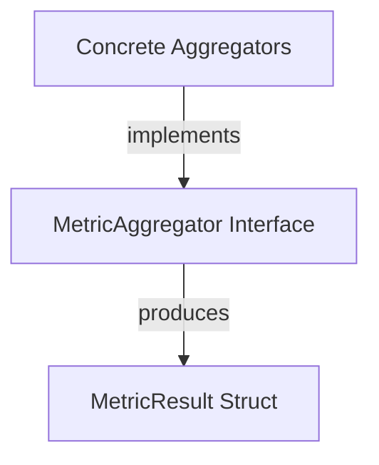

# `metric_data_structures` Module Documentation

## Introduction
This module defines the fundamental data structures and interfaces for metric aggregation within the system. It primarily focuses on representing aggregated metric results and providing a standardized interface for various metric aggregation strategies. As a sub-module of `aggregator_interfaces_and_types`, it provides the core definitions necessary for the broader `metric_aggregation` process.

## Core Functionality

*   ### `MetricResult`
    This structure encapsulates the outcome of a metric aggregation process. It holds a set of labels identifying the specific metric and an array of `MetricValue` objects, representing the time-series data points. This provides a standardized format for aggregated metric output.

    ```go
    type MetricResult struct {
    	MetricLabels map[string]string
    	Values       []MetricValue
    }
    ```

*   ### `MetricAggregator`
    This interface defines the contract for any component responsible for aggregating metrics. Implementations of this interface handle the logic for updating metric values over time and providing the aggregated results.

    *   `AdditionInfo()`: Returns additional information associated with the aggregator, often used for debugging or metadata.
    *   `Update(value float64, timestamp time.Time, additionalInfo map[string]string)`: Incorporates a new metric value, its timestamp, and any relevant additional context into the aggregation.
    *   `Value()`: Retrieves the current aggregated `MetricValue`s, representing the processed time-series data.
    *   `LabelValues()`: Returns the labels associated with the aggregated metric, crucial for identifying and categorizing the metric.

    ```go
    type MetricAggregator interface {
    	AdditionInfo() map[string]string
    	Update(value float64, timestamp time.Time, additionalInfo map[string]string)
    	Value() []MetricValue
    	LabelValues() []string
    }
    ```

## Architecture and Component Relationships
This module provides the core building blocks for metric aggregation. The `MetricAggregator` interface is implemented by concrete aggregators (defined in the `concrete_aggregators` module) that process raw metric data and produce `MetricResult` objects. The `MetricResult` then serves as a standardized output format for these aggregated metrics, which can be further processed or stored by other parts of the system.

<!-- DIAGRAM_JSON
{
    "direction": "TD",
    "nodes": [
        {"id": "metric_aggregator_interface", "label": "MetricAggregator Interface", "type": "component", "link": null},
        {"id": "metric_result_struct", "label": "MetricResult Struct", "type": "component", "link": null},
        {"id": "concrete_aggregators", "label": "Concrete Aggregators", "type": "external", "link": "concrete_aggregators.md"}
    ],
    "edges": [
        {"source": "concrete_aggregators", "target": "metric_aggregator_interface", "label": "implements"},
        {"source": "metric_aggregator_interface", "target": "metric_result_struct", "label": "produces"}
    ],
    "groups": []
}
-->


## How the Module Fits into the Overall System
The `metric_data_structures` module is a foundational part of the `metric_aggregation` system. It defines the common language and contracts for how metrics are aggregated and represented. The parent `metric_aggregation` module relies on these definitions to manage and process various types of metrics from different sources. Concrete implementations of `MetricAggregator` are developed in `concrete_aggregators.md` to handle specific aggregation logic, while `MetricResult` provides a uniform data format for downstream systems that consume aggregated metrics, such as storage or reporting modules. This centralizes the definition of metric data, ensuring consistency and interoperability across the aggregation pipeline.
