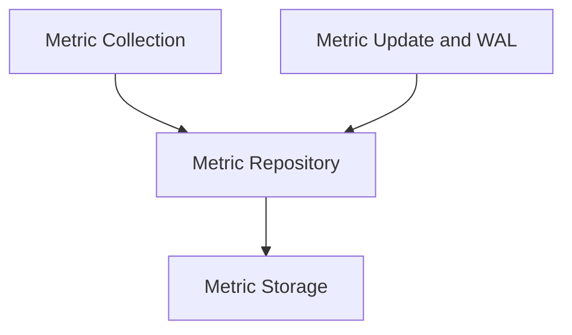

# Metric Management Module

## Introduction
The `metric_management` module is responsible for the collection, storage, and persistence of various metrics within the system. It provides mechanisms for defining metrics, aggregating their values, and ensuring data integrity through a Write-Ahead Log (WAL) system. This module is critical for monitoring system performance, resource utilization, and other key operational indicators.

## Architecture Overview
The `metric_management` module is composed of several key sub-modules that work together to provide a robust metric handling system. These sub-modules include metric collection, a centralized repository for metric stores, the underlying storage mechanisms, and a component for handling metric updates and ensuring data durability via a Write-Ahead Log.

<!-- DIAGRAM_JSON
{
    "direction": "TD",
    "nodes": [
        {"id": "metric_collection", "label": "Metric Collection", "type": "module", "link": "metric_collection.md"},
        {"id": "metric_repository", "label": "Metric Repository", "type": "module", "link": "metric_repository.md"},
        {"id": "metric_storage", "label": "Metric Storage", "type": "module", "link": "metric_storage.md"},
        {"id": "metric_update_and_wal", "label": "Metric Update and WAL", "type": "module", "link": "metric_update_and_wal.md"}
    ],
    "edges": [
        {"source": "metric_collection", "target": "metric_repository"},
        {"source": "metric_repository", "target": "metric_storage"},
        {"source": "metric_update_and_wal", "target": "metric_repository"}
    ],
    "groups": []
}
-->

## Sub-modules and their Functionality:

### Metric Collection ([`metric_collection.md`](metric_collection.md))
This sub-module defines how individual metrics are collected and aggregated. It includes the `MetricCollector` component, which encapsulates the logic for a specific metric, its labels, and the aggregation strategy.

### Metric Repository ([`metric_repository.md`](metric_repository.md))
The `MetricRepository` acts as a central hub for managing different `MetricStore` instances, organized by resolution. It ensures that metric data is stored and retrieved efficiently across various time granularities, providing a consistent interface for accessing metric data.

### Metric Storage ([`metric_storage.md`](metric_storage.md))
This sub-module provides the core functionality for storing and querying metrics. It defines the `MetricStore` interface, allowing for different storage implementations. The `InMemoryMetricStore` is provided for rapid access to recent metric data.

### Metric Update and WAL ([`metric_update_and_wal.md`](metric_update_and_wal.md))
This sub-module is concerned with how metric updates are structured and persisted. It includes the `UpdateSet` for bundling multiple updates and the `Walinator` component, which implements a Write-Ahead Log to ensure that all metric updates are durable and recoverable even in the event of system failures.
