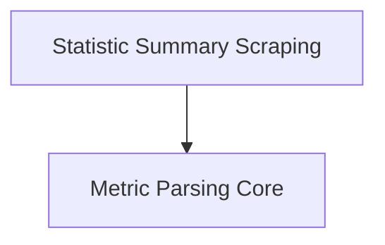

# Metric Parsing and Statistics Module Documentation

## Introduction and Purpose
The `metric_parsing_and_stats` module is responsible for processing raw metric data, parsing it into a structured format, and managing the scraping of statistical summaries from various sources. It forms a critical part of the data collection pipeline, ensuring metrics are correctly interpreted and made available for further analysis.

## Architecture Overview
The module is logically divided into two main sub-modules: `metric_parsing` and `stat_summary_scraping`. `metric_parsing` focuses on the transformation of raw text-based metrics into a standardized data structure, while `stat_summary_scraping` handles the retrieval of pre-aggregated statistical data.

<!-- DIAGRAM_JSON
{
    "direction": "TD",
    "nodes": [
        {"id": "metric_parsing", "label": "Metric Parsing Core", "type": "module", "link": "metric_parsing.md"},
        {"id": "stat_summary_scraping", "label": "Statistic Summary Scraping", "type": "module", "link": "stat_summary_scraping.md"}
    ],
    "edges": [
        {"source": "stat_summary_scraping", "target": "metric_parsing"}
    ],
    "groups": []
}
-->

## Sub-modules

### [Metric Parsing Core](metric_parsing.md)
This sub-module contains the fundamental logic for parsing metric data. It includes the `parser` which uses a lexer to interpret raw input, and the `MetricRecord` structure which defines the standardized format for storing parsed metrics.

### [Statistic Summary Scraping](stat_summary_scraping.md)
Responsible for collecting statistical summaries. It leverages the `StatSummaryScraper` to interact with external services via a `nodestats.StatSummaryClient` and includes testing utilities like `mockStatSummaryClient`.
