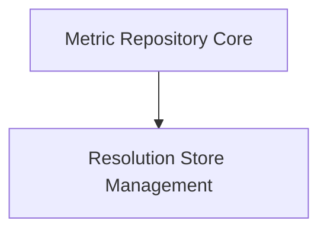

# Metric Repository Module Documentation

## Introduction

The `metric_repository` module is a core component responsible for the efficient storage and retrieval of collected metrics within the system. It ensures thread-safe access to metric data, organizing it by various resolutions to support diverse analytical and reporting needs. This module acts as a central hub for metric management, providing foundational capabilities for data persistence and access.

## Architecture Overview

The `metric_repository` module is structured around two primary sub-modules:

1.  **Metric Repository Core (`metric_repository_core`):** This is the central entry point, maintaining a collection of resolution-specific stores.
2.  **Resolution Store Management (`resolution_store_management`):** Each instance of this sub-module manages the storage and retrieval of metrics for a specific time resolution, utilizing various `MetricStore` implementations.

The `metric_repository_core` component aggregates and orchestrates interactions with multiple `resolution_store_management` instances, allowing for a flexible and scalable approach to metric data handling.

<!-- DIAGRAM_JSON
{
    "direction": "TD",
    "nodes": [
        {"id": "metric_repository_core", "label": "Metric Repository Core", "type": "module", "link": "metric_repository_core.md"},
        {"id": "resolution_store_management", "label": "Resolution Store Management", "type": "module", "link": "resolution_store_management.md"}
    ],
    "edges": [
        {"source": "metric_repository_core", "target": "resolution_store_management"}
    ],
    "groups": []
}
-->

## Sub-module Functionality

### [Metric Repository Core](metric_repository_core.md)

This sub-module encapsulates the `MetricRepository` component, serving as the main interface for metric storage operations. It is responsible for managing the lifecycle and access to different `resolutionStores`, ensuring concurrent operations are handled safely using a mutex.

### [Resolution Store Management](resolution_store_management.md)

This sub-module, built around the `resolutionStores` component, focuses on handling metrics for a specific resolution. It maintains a collection of `MetricStore` instances, each capable of storing metrics, and uses a factory to create new `MetricStore` objects as needed. It also employs a mutex to ensure thread-safe access to its internal components.
