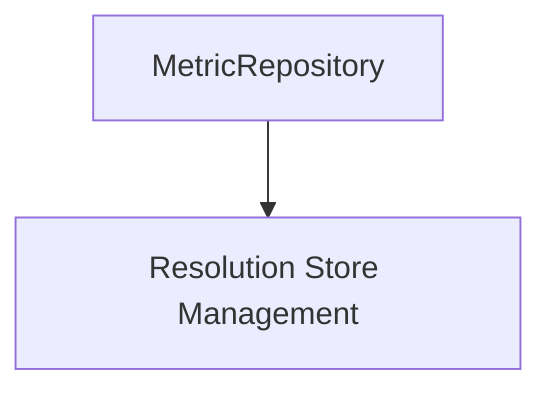

# metric_repository_core Module Documentation

## Introduction

The `metric_repository_core` module serves as the central component for managing and storing metric data within the system. It provides the foundational structure for handling concurrent access to metric resolution stores and ensuring data integrity.

## Architecture and Core Functionality

The core of the `metric_repository_core` module is the `MetricRepository` struct. This struct is responsible for:

*   **Concurrency Control**: Utilizing a `sync.Mutex` to manage concurrent read and write operations, ensuring data consistency across multiple access points.
*   **Resolution Store Management**: Maintaining a collection of `resolutionStores`, which are external components responsible for the actual storage and retrieval of metric data at different resolutions.

### MetricRepository

```go
type MetricRepository struct {
	lock             sync.Mutex
	resolutionStores map[string]*resolutionStores
}
```

### Component Relationships and Dependencies

The `metric_repository_core` module primarily interacts with the `resolution_store_management` module. The `MetricRepository` holds references to `resolutionStores`, delegating the actual persistence and retrieval of metrics to these external components.

<!-- DIAGRAM_JSON
{
    "direction": "TD",
    "nodes": [
        {"id": "metric_repository", "label": "MetricRepository", "type": "component", "link": null},
        {"id": "resolution_store_management", "label": "Resolution Store Management", "type": "external", "link": "resolution_store_management.md"}
    ],
    "edges": [
        {"source": "metric_repository", "target": "resolution_store_management"}
    ],
    "groups": []
}
-->



## Integration with the Overall System

The `metric_repository_core` module is a fundamental part of the `metric_repository` module, which itself is nested within the `metric_management` module. It acts as the direct interface for other parts of the system that need to store or retrieve metric data. By abstracting the underlying storage mechanisms (managed by `resolution_store_management`), `metric_repository_core` provides a consistent and thread-safe way to interact with metric data.

It plays a crucial role in the overall data flow, ensuring that metrics collected by various components are properly stored and made available for aggregation, analysis, and reporting. Its robust concurrency control is vital for high-throughput metric collection systems.

Refer to the [metric_repository](metric_repository.md) and [metric_management](metric_management.md) documentation for a broader understanding of its place within the metric handling system.
