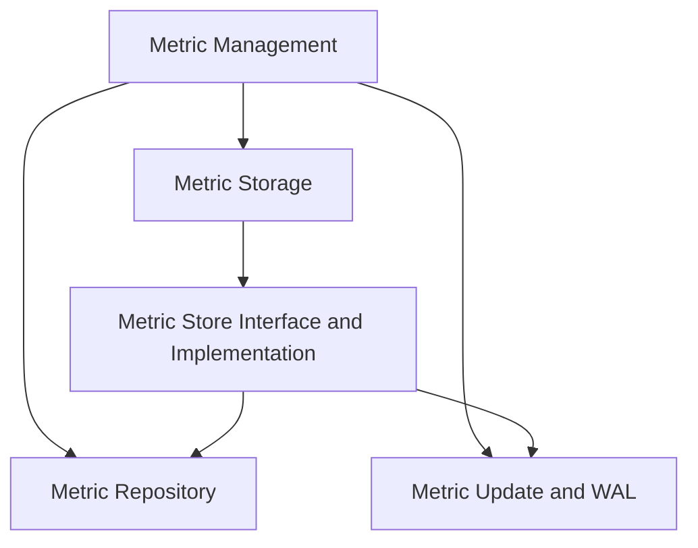

# Metric Storage Module Documentation

## Introduction
The `metric_storage` module is a crucial component responsible for defining the interfaces and providing implementations for storing, updating, and querying metric data within the system. It acts as the backbone for metric persistence and retrieval, ensuring that collected metrics are readily available for analysis and reporting.

## Architecture Overview
The `metric_storage` module is nested under the `metric_management` module, which itself resides within the top-level `modules` directory. It plays a foundational role in the overall metric management ecosystem, interacting closely with other sub-modules like `metric_repository` for data definition and `metric_update_and_wal` for write-ahead logging and updates. This module provides the concrete mechanisms for handling metric data, abstracting the specifics of storage from higher-level concerns.

## Sub-modules

### Metric Store Interface and Implementation
This sub-module, detailed in [metric_store_interface_and_implementation.md](metric_store_interface_and_implementation.md), defines the fundamental `MetricStore` interface and provides its `InMemoryMetricStore` implementation. It encapsulates the core logic for registering metric collectors, unregistering them, querying stored metrics, and updating metric values over time.

## Architecture Diagram

<!-- DIAGRAM_JSON
{
    "direction": "TD",
    "nodes": [
        {"id": "metric_management", "label": "Metric Management", "type": "module", "link": "metric_management.md"},
        {"id": "metric_storage", "label": "Metric Storage", "type": "module", "link": "metric_storage.md"},
        {"id": "metric_store_interface_and_implementation", "label": "Metric Store Interface and Implementation", "type": "module", "link": "metric_store_interface_and_implementation.md"},
        {"id": "metric_repository", "label": "Metric Repository", "type": "module", "link": "metric_repository.md"},
        {"id": "metric_update_and_wal", "label": "Metric Update and WAL", "type": "module", "link": "metric_update_and_wal.md"}

    ],
    "edges": [
        {"source": "metric_management", "target": "metric_storage"},
        {"source": "metric_storage", "target": "metric_store_interface_and_implementation"},
        {"source": "metric_management", "target": "metric_repository"},
        {"source": "metric_management", "target": "metric_update_and_wal"},
        {"source": "metric_store_interface_and_implementation", "target": "metric_repository"},
        {"source": "metric_store_interface_and_implementation", "target": "metric_update_and_wal"}
    ],
    "groups": []
}
-->

