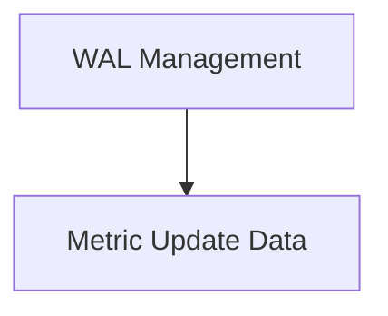

# Metric Update and WAL Module Documentation

## Introduction

The `metric_update_and_wal` module is responsible for handling the processing, storage, and management of metric updates, leveraging a Write-Ahead Log (WAL) mechanism to ensure data durability and integrity. This module plays a crucial role in the `metric_management` system by efficiently capturing and persisting changes to metric data before they are applied to the primary storage.

## Architecture Overview

The module is structured into two main sub-modules: `metric_updates` and `wal_management`. These sub-modules work together to define the structure of metric updates and manage their persistence through the WAL.

<!-- DIAGRAM_JSON
{
    "direction": "TD",
    "nodes": [
        {"id": "metric_updates", "label": "Metric Update Data", "type": "module", "link": "metric_updates.md"},
        {"id": "wal_management", "label": "WAL Management", "type": "module", "link": "wal_management.md"}
    ],
    "edges": [
        {"source": "wal_management", "target": "metric_updates"}
    ],
    "groups": []
}
-->

## Sub-modules

### [Metric Update Data](metric_updates.md)

This sub-module defines the fundamental data structure, `UpdateSet`, which encapsulates a collection of metric updates along with a timestamp. It serves as the canonical representation of a batch of changes to be processed or logged.

### [WAL Management](wal_management.md)

The `wal_management` sub-module provides the core functionality for implementing the Write-Ahead Log. It includes `Walinator`, which orchestrates the storage, path formatting, exporting, and processing of `UpdateSet` instances. The `fileInfo` component assists in managing the metadata for WAL files. This sub-module ensures that metric updates are durably recorded before committing them, allowing for recovery in case of system failures.
