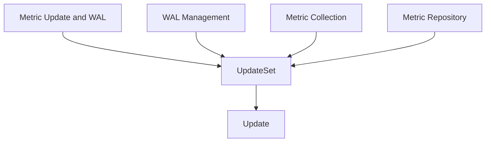

# Module: `metric_updates`

## Introduction
The `metric_updates` module is a fundamental component within the metric management system, specifically designed to define the data structures for encapsulating and transporting metric changes. It provides the core models, `UpdateSet` and `Update`, which are used throughout the system to represent collected metric data before it is processed, stored, or acted upon.

## Purpose and Core Functionality
The primary purpose of the `metric_updates` module is to standardize the format in which metric data, especially changes or new observations, are represented.
*   **`UpdateSet`**: This structure groups one or more individual metric updates that occurred at a specific `Timestamp`. It acts as a logical container for a batch of related metric changes.
    ```go
    type UpdateSet struct {
        Timestamp time.Time `json:"timestamp"`
        Updates   []Update  `json:"updates"`
    }
    ```
*   **`Update`**: This structure defines a single metric observation or change. It includes all necessary details to identify and quantify the metric.
    ```go
    type Update struct {
        Name           string            `json:"name"`
        Labels         map[string]string `json:"labels"`
        Value          float64           `json:"value"`
        AdditionalInfo map[string]string `json:"additionalInfo"`
    }
    ```
    *   `Name`: The unique identifier for the metric.
    *   `Labels`: Key-value pairs providing additional dimensions or metadata for the metric (e.g., instance, region, service).
    *   `Value`: The numerical value of the metric at the given timestamp.
    *   `AdditionalInfo`: A flexible field for any other pertinent information that doesn't fit into `Labels`.

This module ensures data consistency and facilitates seamless data exchange between different parts of the metric pipeline.

## Architecture and Component Relationships

The `metric_updates` module itself contains two primary components: `UpdateSet` and `Update`. These components are intrinsically linked, with `UpdateSet` acting as a collection of `Update` objects.

It integrates with several other modules:
*   **`metric_update_and_wal`**: As a sub-module of `metric_update_and_wal`, `metric_updates` provides the data types that the parent module uses for managing metric updates and the Write-Ahead Log.
*   **`wal_management`**: This sibling module likely processes or stores `UpdateSet` objects within its Write-Ahead Log mechanisms.
*   **`metric_collection`**: This module is responsible for gathering raw metric data and would format it into `UpdateSet` objects for further processing.
*   **`metric_repository`**: This module, responsible for persistent storage and retrieval of metrics, would store and potentially retrieve `UpdateSet` or `Update` objects.

<!-- DIAGRAM_JSON
{
    "direction": "TD",
    "nodes": [
        {"id": "update_set", "label": "UpdateSet", "type": "component", "link": null},
        {"id": "update", "label": "Update", "type": "component", "link": null},
        {"id": "metric_update_and_wal", "label": "Metric Update and WAL", "type": "external", "link": "metric_update_and_wal.md"},
        {"id": "wal_management", "label": "WAL Management", "type": "external", "link": "wal_management.md"},
        {"id": "metric_collection", "label": "Metric Collection", "type": "external", "link": "metric_collection.md"},
        {"id": "metric_repository", "label": "Metric Repository", "type": "external", "link": "metric_repository.md"}
    ],
    "edges": [
        {"source": "update_set", "target": "update"},
        {"source": "metric_update_and_wal", "target": "update_set"},
        {"source": "wal_management", "target": "update_set"},
        {"source": "metric_collection", "target": "update_set"},
        {"source": "metric_repository", "target": "update_set"}
    ],
    "groups": []
}
-->


## How the Module Fits into the Overall System
The `metric_updates` module serves as the standardized data interface for all metric-related operations within the system. It enables a clear separation of concerns by defining *what* a metric update looks like, allowing other modules to focus on *how* to collect, store, process, or react to these updates.

It sits within the `metric_update_and_wal` module, highlighting its role in the initial ingestion and logging phases of metric data. By providing robust and well-defined data structures, it ensures data integrity and consistency across the entire metric management pipeline, from collection to long-term storage and analysis. This module is critical for reliable and efficient metric handling, forming the backbone for accurate monitoring and reporting.
