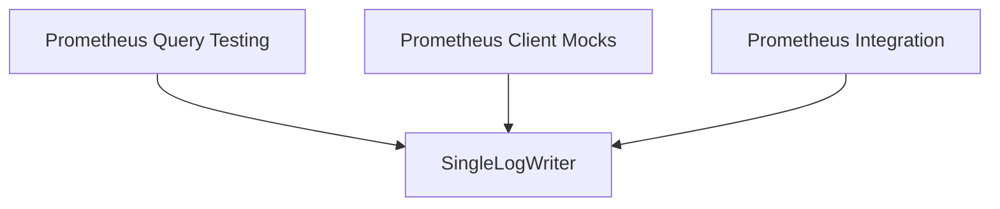

# metrics_querier_testing

The `metrics_querier_testing` module provides essential utilities for testing the Prometheus metrics querier within the larger Prometheus integration framework. It focuses on facilitating isolated and reliable testing of metric querying functionalities.

## Purpose and Core Functionality

This module primarily supports the testing efforts for Prometheus metric querying. Its core component, `SingleLogWriter`, is designed to capture and manage log output during test executions. This is crucial for asserting expected log messages, debugging test failures, and ensuring that the metrics querier behaves as expected under various scenarios without interfering with actual logging mechanisms.

### Core Components

#### SingleLogWriter

The `SingleLogWriter` is a simple struct used for accumulating log messages as a string. This allows test cases to easily inspect and assert against the log output generated by the components under test.

```go
type SingleLogWriter struct {
	Log string
}
```

## Architecture and Component Relationships

The `metrics_querier_testing` module is a leaf module within the `testing_utilities` sub-module of `prometheus_integration`. It contains specific components like `SingleLogWriter` that are utilized by other testing modules, such as [prometheus_query_testing](prometheus_query_testing.md), to simulate or capture specific behaviors during tests. It also interacts with [prometheus_client_mocks](prometheus_client_mocks.md) for mocking Prometheus client interactions. The module contributes to the overall testing strategy for the [prometheus_integration](prometheus_integration.md) module.

<!-- DIAGRAM_JSON
{
    "direction": "TD",
    "nodes": [
        {"id": "single_log_writer", "label": "SingleLogWriter", "type": "component", "link": null},
        {"id": "prometheus_query_testing", "label": "Prometheus Query Testing", "type": "external", "link": "prometheus_query_testing.md"},
        {"id": "prometheus_client_mocks", "label": "Prometheus Client Mocks", "type": "external", "link": "prometheus_client_mocks.md"},
        {"id": "prometheus_integration", "label": "Prometheus Integration", "type": "external", "link": "prometheus_integration.md"}
    ],
    "edges": [
        {"source": "prometheus_query_testing", "target": "single_log_writer"},
        {"source": "prometheus_client_mocks", "target": "single_log_writer"},
        {"source": "prometheus_integration", "target": "single_log_writer"}
    ],
    "groups": []
}
-->


## How the Module Fits into the Overall System

This module plays a critical role in ensuring the reliability and correctness of the Prometheus integration. By providing dedicated testing utilities, it allows developers to thoroughly validate the metrics querier's behavior, identify regressions, and maintain a high standard of quality for metric data collection and analysis. It is an integral part of the overall `prometheus_integration` testing suite, ensuring that changes to the Prometheus client or metrics querying logic do not introduce unexpected issues.
