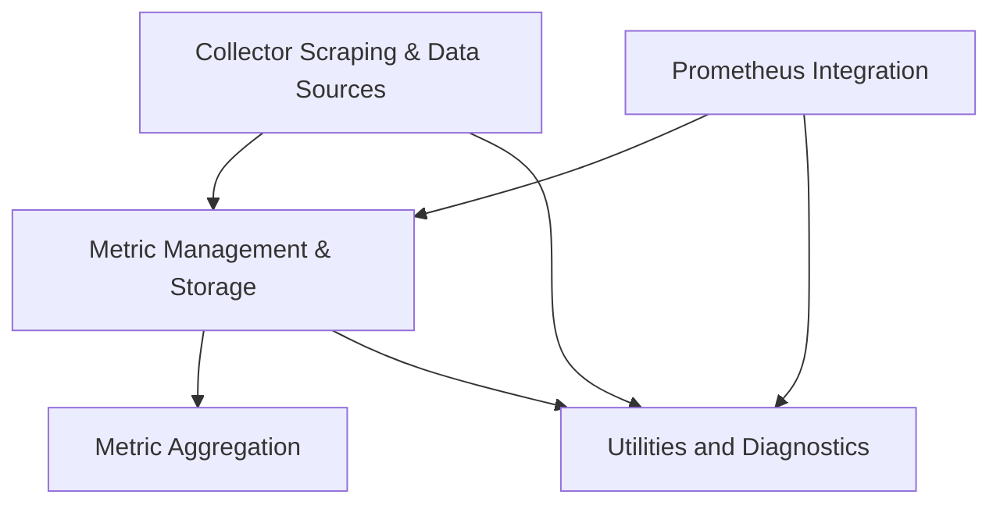

# Modules Documentation

The `modules` module serves as the central hub for data collection, metric processing, and external system integration within the larger application. It encapsulates the core logic for scraping data, managing metrics, performing aggregations, and interacting with external data sources like Prometheus.

## Architecture Overview

The module is composed of several key sub-modules that work in concert to achieve its objectives. The `collector_scraping` module is responsible for gathering raw data, which is then managed and stored by the `metric_management` module. Metric data within the `metric_management` module can be further processed and transformed by the `metric_aggregation` module. For external data sourcing, the `prometheus_integration` module provides a dedicated interface to Prometheus. All these operations are supported by the `utilities_diagnostics` module, which offers common utilities and diagnostic capabilities.

<!-- DIAGRAM_JSON
{
    "direction": "TD",
    "nodes": [
        {"id": "collector_scraping", "label": "Collector Scraping & Data Sources", "type": "module", "link": "collector_scraping.md"},
        {"id": "metric_management", "label": "Metric Management & Storage", "type": "module", "link": "metric_management.md"},
        {"id": "metric_aggregation", "label": "Metric Aggregation", "type": "module", "link": "metric_aggregation.md"},
        {"id": "prometheus_integration", "label": "Prometheus Integration", "type": "module", "link": "prometheus_integration.md"},
        {"id": "utilities_diagnostics", "label": "Utilities and Diagnostics", "type": "module", "link": "utilities_diagnostics.md"}
    ],
    "edges": [
        {"source": "collector_scraping", "target": "metric_management"},
        {"source": "prometheus_integration", "target": "metric_management"},
        {"source": "metric_management", "target": "metric_aggregation"},
        {"source": "collector_scraping", "target": "utilities_diagnostics"},
        {"source": "prometheus_integration", "target": "utilities_diagnostics"},
        {"source": "metric_management", "target": "utilities_diagnostics"}
    ],
    "groups": []
}
-->

## Sub-modules

*   **[Collector Scraping & Data Sources](collector_scraping.md)**: Provides mechanisms for scraping data from various sources like cluster caches and networks, parsing metrics, and controlling the scraping process.
*   **[Metric Management & Storage](metric_management.md)**: Manages the lifecycle of metrics, including collection, storage in repositories, and handling updates and persistence.
*   **[Metric Aggregation](metric_aggregation.md)**: Handles various aggregation operations on collected metrics, such as calculating averages, maximums, rates, and uptimes over specified periods.
*   **[Prometheus Integration](prometheus_integration.md)**: Facilitates integration with Prometheus, handling queries, rate limiting, cluster mapping, and diagnostics related to Prometheus data sources.
*   **[Utilities and Diagnostics](utilities_diagnostics.md)**: Provides general utility functions for configuration, intervals, and a comprehensive diagnostics framework for monitoring the collector and metric processes.
