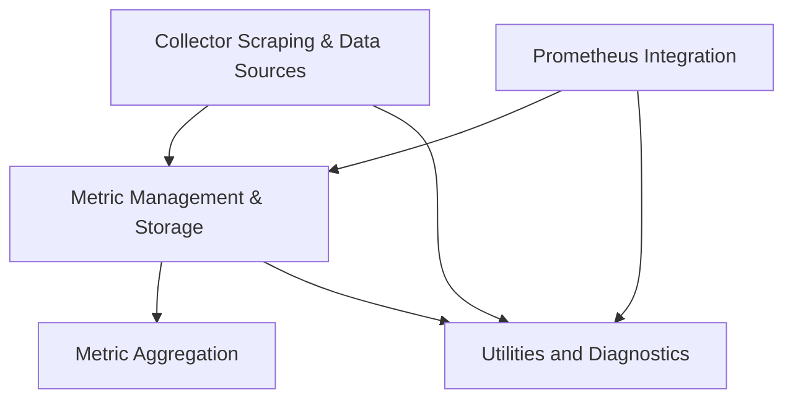

The `kubecost` repository provides a comprehensive solution for Kubernetes cost monitoring, optimization, and management. It integrates with various cloud providers to gather pricing data, collects detailed Kubernetes resource metrics, and applies a sophisticated cost model to provide granular cost allocation, asset tracking, and efficiency insights. The system supports custom cost inputs, carbon footprint calculations, and robust data storage and export capabilities, enabling users to understand and control their cloud spend within Kubernetes environments.

### Architecture Overview

The `kubecost` system is structured around several key modules that handle data collection, metric processing, and integration with external systems. The `Collector Scraping & Data Sources` module is responsible for gathering raw data from various sources. This data is then managed and stored by the `Metric Management & Storage` module. The `Metric Aggregation` module processes and transforms metric data, while the `Prometheus Integration` module provides a dedicated interface for sourcing data from Prometheus. All these operations are supported by the `Utilities and Diagnostics` module, which offers common utilities and diagnostic capabilities.

