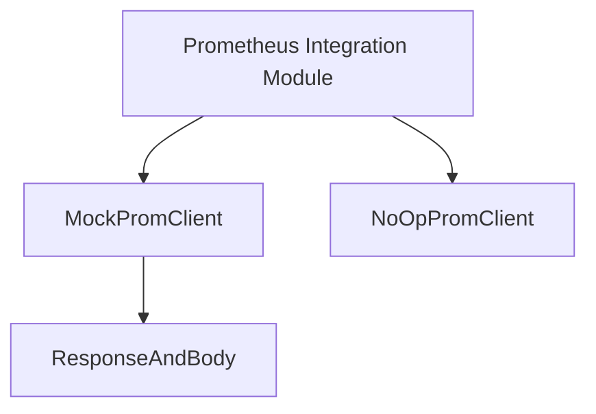

# prometheus_client_mocks

The `prometheus_client_mocks` module provides essential utilities for testing components that interact with Prometheus. It offers mock implementations of Prometheus clients, allowing for isolated and controlled testing environments without requiring a live Prometheus instance.

## Architecture and Component Relationships

This module contains several key components designed to facilitate mocking Prometheus client behavior in unit and integration tests.

<!-- DIAGRAM_JSON
{
    "direction": "TD",
    "nodes": [
        {"id": "response_and_body", "label": "ResponseAndBody", "type": "component", "link": null},
        {"id": "mock_prom_client", "label": "MockPromClient", "type": "component", "link": null},
        {"id": "noop_prom_client", "label": "NoOpPromClient", "type": "component", "link": null},
        {"id": "prometheus_integration", "label": "Prometheus Integration Module", "type": "external", "link": "prometheus_integration.md"}
    ],
    "edges": [
        {"source": "mock_prom_client", "target": "response_and_body"},
        {"source": "prometheus_integration", "target": "mock_prom_client"},
        {"source": "prometheus_integration", "target": "noop_prom_client"}
    ],
    "groups": []
}
-->


### Module Components

#### ResponseAndBody
(Defined in `modules/prometheus-source/pkg/prom/ratelimitedclient_test.go`)

The `ResponseAndBody` struct encapsulates an HTTP response and its corresponding body. It is primarily used by `MockPromClient` to predefine responses that the mock client should return during testing. This allows testers to simulate various HTTP scenarios, including successful responses, errors, and different content types.

```go
type ResponseAndBody struct {
	Response *http.Response
	Body     []byte
}
```

#### MockPromClient
(Defined in `modules/prometheus-source/pkg/prom/ratelimitedclient_test.go`)

The `MockPromClient` provides a controllable mock implementation of a Prometheus client. It uses a `sync.Mutex` for concurrency safety and maintains a slice of `ResponseAndBody` objects. During tests, it can return these predefined responses in a sequential manner, allowing for deterministic testing of Prometheus client interactions. This component is crucial for unit and integration tests that need to simulate the behavior of the actual Prometheus client without making actual network calls.

```go
type MockPromClient struct {
	sync.Mutex
	responses []*ResponseAndBody
	current   int
}
```

#### NoOpPromClient
(Defined in `modules/prometheus-source/pkg/prom/metricsquerier_test.go`)

The `NoOpPromClient` is a no-operation implementation of a Prometheus client. It serves as a placeholder for tests where the actual Prometheus client functionality is not required or should be bypassed. This is particularly useful in tests focusing on other parts of the system that might have a dependency on a Prometheus client interface but don't need its concrete implementation to perform an action.

```go
type NoOpPromClient struct {
}
```

## How the Module Fits into the Overall System

The `prometheus_client_mocks` module is a sub-module of `testing_utilities`, which in turn is part of the larger [prometheus_integration](prometheus_integration.md) module. Its primary role is to provide robust testing capabilities for components within the `prometheus_integration` module and other parts of the system that interact with Prometheus. By offering mock clients, it enables developers to:

*   **Isolate tests**: Test components that depend on Prometheus without external dependencies.
*   **Control test scenarios**: Simulate various Prometheus responses, including successful data retrieval, errors, and edge cases.
*   **Accelerate test execution**: Avoid slow network calls to a real Prometheus instance.

This module ensures the reliability and correctness of the Prometheus integration by facilitating comprehensive and efficient testing.
