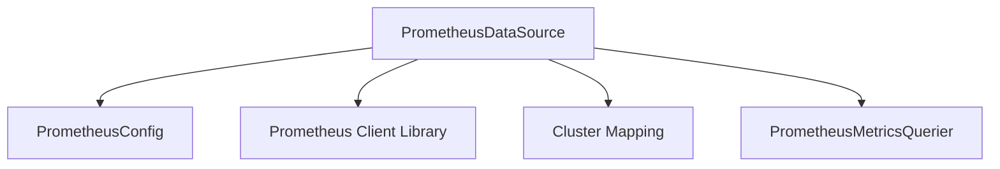

# Module: prometheus_data_source

## Introduction
The `prometheus_data_source` module, a key component within the `prometheus_integration` module, is responsible for establishing and managing the connection to Prometheus instances. It handles the configuration required to query metrics and integrates with cluster-specific information to provide a comprehensive data source.

## Core Functionality

### PrometheusDataSource
The `PrometheusDataSource` struct acts as the primary interface for interacting with Prometheus. It encapsulates all necessary components for querying and managing Prometheus data, including:
-   **Configuration (`promConfig`):** Holds the specific Prometheus configuration details, likely derived from `OpenCostPrometheusConfig`.
-   **Prometheus Client (`promClient`):** The client used to make direct queries to the Prometheus server.
-   **Context Management (`promContexts`):** Manages different query contexts for Prometheus operations.
-   **Metrics Querier (`metricsQuerier`):** A specialized component for executing metric queries against Prometheus.
-   **Cluster Mapping (`clusterMap`):** Provides information about cluster topology and mapping, linking Prometheus data to specific clusters.
-   **Cluster Information Provider (`clusterInfo`):** Offers detailed information about individual clusters.

### PrometheusConfig
The `PrometheusConfig` struct defines the fundamental structure for Prometheus scrape configurations. It is crucial for specifying how Prometheus collects metrics from various targets, typically containing a list of `ScrapeConfig` entries. This configuration is leveraged by the `PrometheusDataSource` to correctly interpret and apply Prometheus scraping rules.

## Architecture

The `prometheus_data_source` module integrates various components to effectively serve as a Prometheus data provider. It depends on external modules for cluster information and utilizes specific components for handling Prometheus interactions and configurations.

<!-- DIAGRAM_JSON
{
    "direction": "TD",
    "nodes": [
        {"id": "prometheus_data_source_component", "label": "PrometheusDataSource", "type": "component", "link": null},
        {"id": "prometheus_config_helper", "label": "PrometheusConfig", "type": "component", "link": null},
        {"id": "metrics_querier_comp", "label": "PrometheusMetricsQuerier", "type": "component", "link": null},
        {"id": "cluster_mapping", "label": "Cluster Mapping", "type": "external", "link": "cluster_mapping.md"},
        {"id": "prometheus_client_lib", "label": "Prometheus Client Library", "type": "external", "link": null}
    ],
    "edges": [
        {"source": "prometheus_data_source_component", "target": "prometheus_config_helper"},
        {"source": "prometheus_data_source_component", "target": "prometheus_client_lib"},
        {"source": "prometheus_data_source_component", "target": "cluster_mapping"},
        {"source": "prometheus_data_source_component", "target": "metrics_querier_comp"}
    ],
    "groups": []
}
-->

## Module Relationships

The `prometheus_data_source` module is a sub-module of `data_source_and_configuration`, which itself is part of the broader `prometheus_integration` module.

-   **Parent Module:** [data_source_and_configuration](data_source_and_configuration.md)
-   **Dependencies:**
    -   [cluster_mapping](cluster_mapping.md): Provides essential cluster-related data for accurate metric querying and attribution.
    -   [core_pkg_clusters](core_pkg_clusters.md): (Implied by `clusters.ClusterMap` and `clusters.ClusterInfoProvider`) Likely provides core cluster management functionalities.
