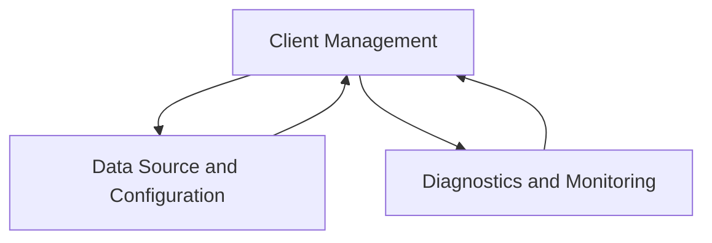

# Prometheus Integration Module

## Introduction
The `prometheus_integration` module facilitates robust interaction with Prometheus, a leading open-source monitoring system. It provides mechanisms for querying Prometheus, handling rate limits, managing cluster information, and offering diagnostic insights into the integration's operational state. This module is critical for fetching metrics and ensuring reliable data flow from Prometheus instances to other parts of the system.

## Architecture Overview
The `prometheus_integration` module is structured into several key sub-modules, each responsible for a distinct aspect of Prometheus interaction. This modular design enhances maintainability, scalability, and testability. The core components revolve around client management for efficient querying, robust diagnostic capabilities, flexible data source configuration, and comprehensive testing utilities.

<!-- DIAGRAM_JSON
{
    "direction": "TD",
    "nodes": [
        {"id": "client_management", "label": "Client Management", "type": "module", "link": "client_management.md"},
        {"id": "data_source_and_configuration", "label": "Data Source and Configuration", "type": "module", "link": "data_source_and_configuration.md"},
        {"id": "diagnostics_and_monitoring", "label": "Diagnostics and Monitoring", "type": "module", "link": "diagnostics_and_monitoring.md"},
        {"id": "testing_utilities", "label": "Testing Utilities", "type": "module", "link": "testing_utilities.md"}
    ],
    "edges": [
        {"source": "client_management", "target": "data_source_and_configuration"},
        {"source": "client_management", "target": "diagnostics_and_monitoring"},
        {"source": "data_source_and_configuration", "target": "client_management"},
        {"source": "diagnostics_and_monitoring", "target": "client_management"}
    ],
    "groups": []
}
-->

## Sub-modules

### [Client Management](client_management.md)
This sub-module focuses on the core Prometheus client functionality, including rate-limited querying, managing work requests, and handling responses. It ensures efficient and controlled communication with Prometheus servers.

### [Data Source and Configuration](data_source_and_configuration.md)
Responsible for setting up and managing Prometheus data sources, including cluster mapping, configuration parsing, and handling metadata. It provides the necessary components to configure and retrieve data from Prometheus.

### [Diagnostics and Monitoring](diagnostics_and_monitoring.md)
Provides tools and structures for diagnosing issues and monitoring the health of the Prometheus integration. This includes tracking queue states, request counters, and defining diagnostic checks to ensure optimal performance.

### [Testing Utilities](testing_utilities.md)
Contains various mock clients, test helpers, and data structures crucial for unit and integration testing of the Prometheus integration components, ensuring the reliability and correctness of the module.
