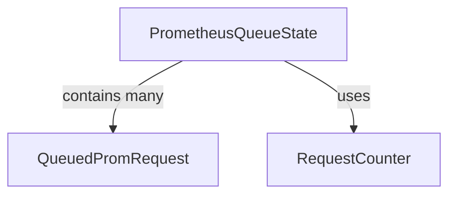

# Request Queue Monitoring Module

## Introduction

The `request_queue_monitoring` module is responsible for providing visibility into the state of requests being processed by the Prometheus integration. It defines data structures and interfaces to monitor queued and outbound Prometheus requests, helping to diagnose potential bottlenecks or performance issues within the system's interaction with Prometheus.

## Architecture and Component Relationships

This module primarily consists of data structures that represent the state of the Prometheus request queue and an interface for counting these requests. It plays a crucial role in the `prometheus_integration` module's diagnostics capabilities by exposing real-time information about request processing.

<!-- DIAGRAM_JSON
{
    "direction": "TD",
    "nodes": [
        {"id": "prometheus_queue_state", "label": "PrometheusQueueState", "type": "component", "link": null},
        {"id": "queued_prom_request", "label": "QueuedPromRequest", "type": "component", "link": null},
        {"id": "request_counter", "label": "RequestCounter", "type": "component", "link": null}
    ],
    "edges": [
        {"source": "prometheus_queue_state", "target": "queued_prom_request", "label": "contains many"},
        {"source": "prometheus_queue_state", "target": "request_counter", "label": "uses"}
    ],
    "groups": []
}
-->



## Core Functionality

### `PrometheusQueueState`

`PrometheusQueueState` is a struct that provides a snapshot of the current state of the Prometheus request queue. It includes details such as the list of currently queued requests, the number of requests actively being processed (outbound), the total number of requests handled, and the maximum allowed concurrency for queries.

```go
type PrometheusQueueState struct {
	QueuedRequests      []*QueuedPromRequest `json:"queuedRequests"`
	OutboundRequests    int                  `json:"outboundRequests"`
	TotalRequests       int                  `json:"totalRequests"`
	MaxQueryConcurrency int                  `json:"maxQueryConcurrency"`
}
```

### `RequestCounter`

The `RequestCounter` interface defines methods for retrieving the total number of queued and outbound Prometheus requests. This interface allows for different implementations of request counting mechanisms while providing a consistent way to access these metrics.

```go
type RequestCounter interface {
	TotalQueuedRequests() int
	TotalOutboundRequests() int
}
```

### `QueuedPromRequest`

`QueuedPromRequest` is a struct representing a single Prometheus request that is currently waiting in the queue. It captures essential information about the request, including its context, the actual query string, and the timestamp when it was added to the queue.

```go
type QueuedPromRequest struct {
	Context   string `json:"context"`
	Query     string `json:"query"`
	QueueTime int64  `json:"queueTime"`
}
```

## How it Fits into the Overall System

The `request_queue_monitoring` module is an integral part of the larger [prometheus_integration](prometheus_integration.md) module, specifically within its diagnostics and monitoring sub-components. It provides the foundational data structures and interfaces necessary for understanding the performance and health of the system's interaction with Prometheus. By exposing queue state and request counts, it enables operators and developers to identify and troubleshoot issues related to Prometheus query processing, ensuring efficient data retrieval and system stability.