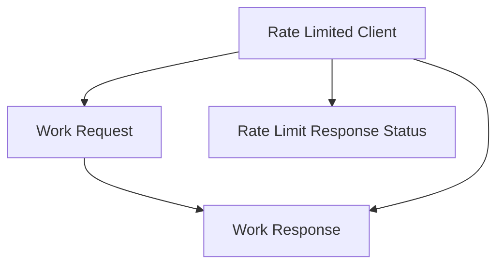

# request_response_models Module Documentation

## Introduction
The `request_response_models` module defines the fundamental data structures used for communicating with the Prometheus API, specifically within the context of a rate-limited client. It provides clear and concise models for encapsulating outgoing requests, incoming responses, and conveying rate-limiting status, ensuring robust and manageable interactions with Prometheus.

## Core Functionality

### `RateLimitResponseStatus`
This structure holds information regarding the status of rate limiting applied to Prometheus API calls. It informs the client about the remaining retries and the required waiting period before making subsequent requests.

```go
type RateLimitResponseStatus struct {
	RetriesRemaining int
	WaitTime         time.Duration
}
```

**Fields:**
*   `RetriesRemaining` (int): Indicates how many retries are left for the current rate-limit window.
*   `WaitTime` (time.Duration): Specifies the duration the client should wait before attempting another request, as dictated by the rate limit.

### `workRequest`
The `workRequest` structure encapsulates all necessary data for an individual request to the Prometheus API, intended to be processed by a worker goroutine, often within a rate-limited client. It includes the context, the HTTP request itself, and a channel for receiving the corresponding response.

```go
type workRequest struct {
	ctx      context.Context
	req      *http.Request
	start    time.Time
	respChan chan *workResponse
	// used as a sentinel value to close the worker goroutine
	closer bool
	// request metadata for diagnostics
	contextName string
	query       string
}
```

**Fields:**
*   `ctx` (context.Context): The context for the request, allowing for cancellation and deadline propagation.
*   `req` (*http.Request): The actual HTTP request object to be sent to Prometheus.
*   `start` (time.Time): The timestamp when the request processing began, useful for tracking latency and diagnostics.
*   `respChan` (chan *workResponse): A channel to which the `workResponse` will be sent once the request is processed. This enables asynchronous communication between the request sender and the worker.
*   `closer` (bool): A sentinel value used to signal the worker goroutine to shut down.
*   `contextName` (string): Metadata for diagnostics, identifying the context of the request.
*   `query` (string): Metadata for diagnostics, storing the Prometheus query string.

### `workResponse`
The `workResponse` structure carries the outcome of a `workRequest`, including the HTTP response, its body, and any error that occurred during the request execution.

```go
type workResponse struct {
	res  *http.Response
	body []byte
	err  error
}
```

**Fields:**
*   `res` (*http.Response): The HTTP response received from the Prometheus API.
*   `body` ([]byte): The raw byte slice of the response body.
*   `err` (error): Any error encountered during the HTTP request or response processing.

## Architecture and Component Relationships

This module's components are integral to the client-side interaction with Prometheus. The `workRequest` and `workResponse` models facilitate the communication pipeline within a concurrent processing system (e.g., a worker pool), where `workRequest`s are submitted and `workResponse`s are received. The `RateLimitResponseStatus` is used to manage and react to rate limits imposed by the Prometheus server. These models are primarily consumed by the [rate_limited_client](rate_limited_client.md) module to manage and execute Prometheus queries efficiently and robustly.

<!-- DIAGRAM_JSON
{
    "direction": "TD",
    "nodes": [
        {"id": "workRequest_node", "label": "Work Request", "type": "component", "link": null},
        {"id": "workResponse_node", "label": "Work Response", "type": "component", "link": null},
        {"id": "rateLimitResponseStatus_node", "label": "Rate Limit Response Status", "type": "component", "link": null},
        {"id": "rate_limited_client", "label": "Rate Limited Client", "type": "external", "link": "rate_limited_client.md"}
    ],
    "edges": [
        {"source": "workRequest_node", "target": "workResponse_node"},
        {"source": "rate_limited_client", "target": "workRequest_node"},
        {"source": "rate_limited_client", "target": "workResponse_node"},
        {"source": "rate_limited_client", "target": "rateLimitResponseStatus_node"}
    ],
    "groups": []
}
-->

