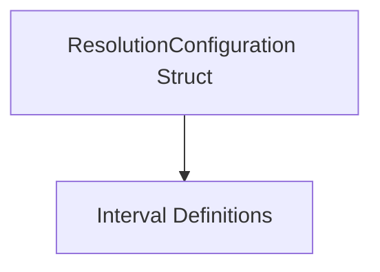

The `resolution_configuration` module provides the foundational data structure for defining how metric data is managed across different time granularities and retention policies within the system. It is a critical component for ensuring that metrics are collected, stored, and retrieved efficiently according to specified requirements.

### Purpose and Core Functionality

The primary purpose of the `resolution_configuration` module is to encapsulate the parameters that dictate the resolution (time interval) at which data is processed and its corresponding retention period. The core component, `ResolutionConfiguration`, defines these parameters:

*   **`Interval`**: Specifies the time granularity for data points, such as "1m" for one minute, "5m" for five minutes, or "1h" for one hour. This string-based interval likely corresponds to definitions provided by the `interval_definitions` module.
*   **`Retention`**: An integer value indicating how long data at the specified `Interval` should be retained, typically measured in units like days or hours, depending on the system's convention.

This configuration allows different metrics or data sets to have varying levels of detail and storage longevity, optimizing storage and query performance.

### Architecture and Component Relationships

The `resolution_configuration` module is a leaf module residing within `modules.utilities_diagnostics.interval_and_resolution`. Its core functionality is embodied by the `ResolutionConfiguration` struct.

<!-- DIAGRAM_JSON
{
    "direction": "TD",
    "nodes": [
        {"id": "resolution_configuration_struct", "label": "ResolutionConfiguration Struct", "type": "component", "link": null},
        {"id": "interval_definitions", "label": "Interval Definitions", "type": "external", "link": "interval_definitions.md"}
    ],
    "edges": [
        {"source": "resolution_configuration_struct", "target": "interval_definitions"}
    ],
    "groups": []
}
-->

The `ResolutionConfiguration` struct explicitly defines the `Interval` field, which implicitly relies on the concepts or definitions provided by the `interval_definitions` module. While `resolution_configuration` itself is a simple data structure, it acts as a crucial input for other modules that handle data storage, aggregation, and querying.

### How it Fits into the Overall System

The `resolution_configuration` module plays a vital role in the system's data management pipeline, particularly in areas related to metric processing and storage. It provides the concrete configuration used by:

*   **Metric Repository and Storage**: Modules like `metric_repository` and `metric_storage` would consume `ResolutionConfiguration` instances to determine how to store incoming metric data, including its time resolution and how long it should be kept before being purged or downsampled.
*   **Metric Aggregation**: Aggregators in the `metric_aggregation` module might use these configurations to perform aggregations at specific intervals and to understand the retention policies for aggregated data.
*   **Collector Scraping**: Data collection components within `collector_scraping` could be configured with these resolutions to collect metrics at appropriate granularities, influencing the overall data volume and detail.
*   **API and Querying**: APIs that expose metric data would use these configurations to understand available data resolutions and retention periods, guiding how users can query historical data.

By centralizing the definition of resolution and retention, this module ensures consistency and configurability across various data-handling components, allowing for flexible and efficient management of time-series data.