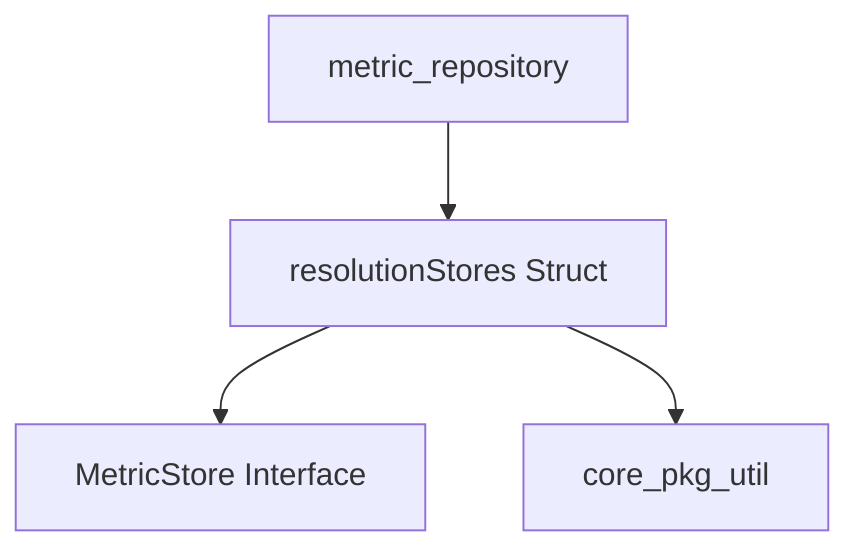

# resolution_store_management Module Documentation

## Introduction
The `resolution_store_management` module is a critical component within the metric collection and storage system, specifically nested under `metric_repository`. Its primary responsibility is to manage various `MetricStore` instances, each tailored to a specific data resolution and associated with a particular collector. This module ensures efficient organization and access to metric data by providing a structured way to handle different metric resolutions and sources.

## Purpose and Core Functionality
The `resolution_store_management` module is centered around the `resolutionStores` struct, which acts as a sophisticated manager for metric data. It provides the following core functionalities:

-   **Resolution-based Metric Storage**: It allows for the segregation and management of metric stores based on their time resolution (e.g., 1-minute, 5-minute, 1-hour data). This is crucial for systems that need to store and query metrics at different granularities.
-   **Collector-specific Management**: Each `MetricStore` instance is mapped to a unique collector ID, enabling the system to distinguish and manage metrics originating from different collection sources.
-   **Concurrency Control**: Utilizes a `sync.Mutex` to ensure thread-safe access to the internal map of collectors, preventing race conditions and data corruption in a multi-threaded environment.
-   **On-demand Store Creation**: Includes a `factory` function that allows for the dynamic creation of new `MetricStore` instances when needed, promoting flexibility and efficient resource allocation.

### Core Component: `resolutionStores`
The `resolutionStores` struct is the heart of this module:

```go
type resolutionStores struct {
	lock       sync.Mutex
	resolution *util.Resolution
	collectors map[int64]MetricStore
	factory    func() MetricStore
}
```

-   `lock` (sync.Mutex): A mutex to protect concurrent access to the `collectors` map.
-   `resolution` (*util.Resolution): A pointer to a `Resolution` object, indicating the time resolution for which this set of `MetricStore` instances is responsible. This type is provided by the `core_pkg_util` module.
-   `collectors` (map[int64]MetricStore): A map where keys are `int64` (representing collector IDs) and values are `MetricStore` interfaces. Each `MetricStore` handles metric data for a specific collector at the module's defined resolution.
-   `factory` (func() MetricStore): A function that, when called, returns a new, initialized `MetricStore` instance. This factory pattern allows for flexible and lazy instantiation of metric stores.

## Architecture and Component Relationships

The `resolution_store_management` module primarily encapsulates the `resolutionStores` struct and its direct interactions. It relies on external modules for fundamental utilities and is utilized by its parent module for broader metric repository functionality.

<!-- DIAGRAM_JSON
{
    "direction": "TD",
    "nodes": [
        {"id": "resolution_stores_struct", "label": "resolutionStores Struct", "type": "component", "link": null},
        {"id": "metric_store", "label": "MetricStore Interface", "type": "component", "link": null},
        {"id": "core_pkg_util", "label": "core_pkg_util", "type": "external", "link": "core_pkg_util.md"},
        {"id": "metric_repository", "label": "metric_repository", "type": "external", "link": "metric_repository.md"}
    ],
    "edges": [
        {"source": "resolution_stores_struct", "target": "metric_store"},
        {"source": "resolution_stores_struct", "target": "core_pkg_util"},
        {"source": "metric_repository", "target": "resolution_stores_struct"}
    ],
    "groups": []
}
-->


## How the Module Fits into the Overall System
The `resolution_store_management` module is an integral part of the `metric_repository` module, which itself is a sub-module of `metric_management`. Its role is to provide the underlying mechanism for storing and retrieving metrics based on their resolution and the collector that gathered them.

-   **Within `metric_repository`**: This module is likely instantiated and managed by the `metric_repository` to handle the actual storage logic for different resolutions. The `metric_repository` would abstract away the resolution management details, providing a unified interface to the rest of the system.
-   **Metric Collection Pipeline**: It serves as a crucial storage layer for the metric collection pipeline, ensuring that collected data is correctly categorized and stored according to its intended resolution.
-   **Data Consistency and Access**: By centralizing resolution-based storage logic, it contributes to data consistency and simplifies data access patterns for higher-level modules that need to retrieve metrics at specific granularities.
