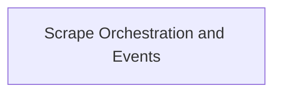

# Scrape Core Module Documentation

## Introduction
The `scrape_core` module is responsible for orchestrating and managing the data scraping processes within the system. It provides the fundamental components for controlling scrape operations and defining the structure of scrape events.

## Architecture Overview
The `scrape_core` module centralizes the logic for initiating and monitoring data collection. It primarily consists of a core component that acts as a controller for various scraping tasks, along with a defined event structure to report the outcomes and details of these operations. This design ensures a clear separation of concerns, where the controller handles the execution flow and the event structure provides standardized feedback.

The module integrates with other parts of the collector-source to perform its functions, acting as a foundational layer for data acquisition.

<!-- DIAGRAM_JSON
{
    "direction": "TD",
    "nodes": [
        {"id": "scrape_orchestration_and_events", "label": "Scrape Orchestration and Events", "type": "module", "link": "scrape_orchestration_and_events.md"}
    ],
    "edges": [],
    "groups": []
}
-->

## Sub-modules
*   [Scrape Orchestration and Events](scrape_orchestration_and_events.md): Manages the core scraping process, including controller logic and event reporting for scrape operations.
