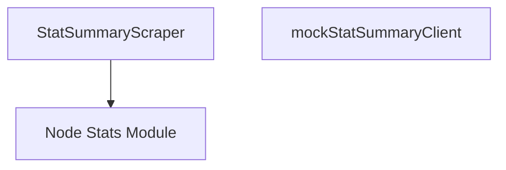

# Stat Summary Scraping Module

The `stat_summary_scraping` module is responsible for collecting statistical summaries, primarily from nodes within the system. It provides the core scraper functionality and a mock client for testing purposes, playing a crucial role in gathering granular performance and health metrics.

<!-- DIAGRAM_JSON
{
    "direction": "TD",
    "nodes": [
        {"id": "stat_summary_scraper", "label": "StatSummaryScraper", "type": "component", "link": null},
        {"id": "mock_stat_summary_client", "label": "mockStatSummaryClient", "type": "component", "link": null},
        {"id": "core_pkg_nodestats", "label": "Node Stats Module", "type": "external", "link": "core_pkg_nodestats.md"}
    ],
    "edges": [
        {"source": "stat_summary_scraper", "target": "core_pkg_nodestats"}
    ],
    "groups": []
}
-->

## Purpose and Core Functionality

The primary purpose of the `stat_summary_scraping` module is to interface with underlying node statistic providers to retrieve `stats.Summary` objects. These summaries likely encapsulate a broad range of metrics and aggregated data points from individual nodes or components.

## Architecture and Component Relationships

The module is composed of two main components:

### StatSummaryScraper

- **Description**: This is the core component responsible for the actual scraping of statistical summaries. It holds a client interface, `nodestats.StatSummaryClient`, which it uses to perform the data retrieval.
- **Dependencies**:
    - `nodestats.StatSummaryClient`: An interface provided by the `core_pkg_nodestats` module, abstracting the details of how node statistics are fetched. This allows the scraper to remain independent of the specific implementation of the statistic gathering mechanism. Refer to [core_pkg_nodestats](core_pkg_nodestats.md) for more details.

### mockStatSummaryClient

- **Description**: A testing utility that implements the `nodestats.StatSummaryClient` interface. It's designed to simulate responses for testing the `StatSummaryScraper` without needing a live `nodestats` client or actual node data. It allows injecting predefined `stats.Summary` results and errors to thoroughly test scraper behavior under various conditions.

## How the Module Fits into the Overall System

The `stat_summary_scraping` module is a sub-module of `modules.collector_scraping.metric_parsing_and_stats`. This placement indicates its role in the broader data collection pipeline:

1.  **Data Collection**: It acts as a specialized collector for node-level statistical summaries.
2.  **Metric Processing**: The collected summaries are then likely passed up to the `metric_parsing_and_stats` module for further processing, parsing, aggregation, or storage.
3.  **System Health and Performance**: By providing statistical summaries, this module contributes to a comprehensive view of the system's health, performance, and resource utilization.

This module ensures that detailed node-level statistics are reliably scraped and made available for the metric analysis components of the system.