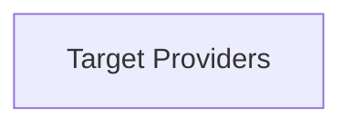

# Target Discovery Module

The `target_discovery` module is a crucial component within the `collector_scraping` system, responsible for identifying and providing various targets from which metrics can be scraped. It abstracts the complexities of discovering different types of resources, such as network endpoints and NVIDIA DCGM (Data Center GPU Manager) enabled devices, ensuring that the scraping process can efficiently gather data from relevant sources.

## Architecture Overview

The `target_discovery` module is structured around its ability to provide specific types of targets. It currently encompasses target providers for network-based services and DCGM-enabled environments. These providers leverage a shared `ClusterCache` to maintain up-to-date information about the cluster, which is essential for accurate target identification. The module integrates with the broader `collector_scraping` system by offering a standardized interface for target enumeration.

<!-- DIAGRAM_JSON
{
    "direction": "TD",
    "nodes": [
        {"id": "target_providers", "label": "Target Providers", "type": "module", "link": "target_providers.md"}
    ],
    "edges": [],
    "groups": []
}
-->

## Sub-modules

*   **[Target Providers](target_providers.md)**: This sub-module contains the core logic for discovering and providing different types of scrape targets. It includes implementations for `NetworkTargetProvider` and `DCGMTargetProvider`, each tailored to identify targets within their respective domains.
