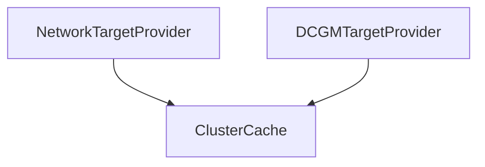

# target_providers Module Documentation

## Introduction
The `target_providers` module, residing within the `collector_scraping.target_discovery` sub-system, is responsible for identifying and providing specific scraping targets to the data collection pipeline. It offers specialized target providers, such as those for network-based targets and NVIDIA DCGM (Data Center GPU Manager) targets, ensuring that the scraping mechanism can discover and connect to various data sources.

## Architecture and Component Relationships

The `target_providers` module defines concrete implementations for discovering different types of scraping targets. It leverages a cluster cache for efficient retrieval of cluster-related information, which is crucial for configuring target discovery.

The module currently includes:
*   **NetworkTargetProvider**: Discovers and provides network-based scraping targets.
*   **DCGMTargetProvider**: Discovers and provides targets specifically for NVIDIA DCGM metrics.

Both providers depend on a `ClusterCache` to access cluster topology and configuration details, enabling them to dynamically determine relevant scraping endpoints.

<!-- DIAGRAM_JSON
{
    "direction": "TD",
    "nodes": [
        {"id": "network_target_provider", "label": "NetworkTargetProvider", "type": "component", "link": null},
        {"id": "dcgm_target_provider", "label": "DCGMTargetProvider", "type": "component", "link": null},
        {"id": "cluster_cache", "label": "ClusterCache", "type": "external", "link": "core_pkg_clustercache.md"}
    ],
    "edges": [
        {"source": "network_target_provider", "target": "cluster_cache"},
        {"source": "dcgm_target_provider", "target": "cluster_cache"}
    ],
    "groups": []
}
-->


## Core Components

### NetworkTargetProvider
The `NetworkTargetProvider` is responsible for identifying and exposing network-based targets for data scraping. It holds the port number on which network metrics are expected to be available and utilizes the `ClusterCache` to fetch necessary cluster context.

```go
type NetworkTargetProvider struct {
	port         int
	clusterCache clustercache.ClusterCache
}
```

### DCGMTargetProvider
The `DCGMTargetProvider` focuses on discovering targets for NVIDIA DCGM metrics. Similar to the network provider, it maintains the relevant port and relies on the `ClusterCache` to gather cluster-specific information required for DCGM target identification.

```go
type DCGMTargetProvider struct {
	clusterCache clustercache.ClusterCache
	port         int
}
```

## Integration with Overall System

The `target_providers` module is a crucial part of the `collector_scraping` module, specifically within its [target_discovery](target_discovery.md) sub-component. It acts as the discovery layer, supplying configured targets to the scraping mechanisms. The discovered targets are then consumed by the scraping engine to fetch metrics. Its dependency on the [core_pkg_clustercache](core_pkg_clustercache.md) module highlights its integration with the system's overall cluster management and caching capabilities.
