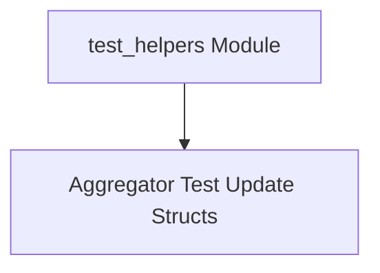

# test_helpers Module Documentation

## Introduction
The `test_helpers` module provides essential utilities and data structures specifically designed to support the testing of various metric aggregators within the system. Its primary role is to ensure consistency and ease of data simulation during the unit and integration testing phases of aggregator development.

## Architecture
The `test_helpers` module is structured around its core responsibility of providing consistent test data models. It currently comprises one main sub-module:

<!-- DIAGRAM_JSON
{
    "direction": "TD",
    "nodes": [
        {"id": "test_helpers_module", "label": "test_helpers Module", "type": "module"},
        {"id": "aggregator_test_updates", "label": "Aggregator Test Update Structs", "type": "module", "link": "aggregator_test_updates.md"}
    ],
    "edges": [
        {"source": "test_helpers_module", "target": "aggregator_test_updates"}
    ],
    "groups": []
}
-->

## Sub-modules

### [Aggregator Test Update Structs](aggregator_test_updates.md)
This sub-module defines the `update` struct, a consistent data model used across various metric aggregator tests. It standardizes the representation of metric updates, including value, timestamp, and additional information, facilitating reliable and repeatable testing.
