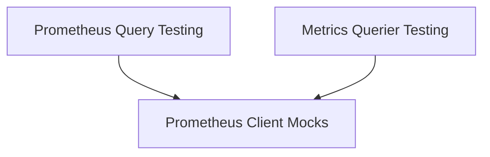

# Testing Utilities Module

## Introduction

The `testing_utilities` module provides a suite of tools and mock implementations specifically designed to facilitate robust testing of Prometheus client interactions, queries, and metrics queriers within the system. It enables developers to simulate various scenarios, mock external dependencies, and verify the correctness of data processing and API calls without relying on live Prometheus instances.

## Architecture Overview

This module is structured into several sub-modules, each focusing on a specific aspect of testing. The relationships and dependencies between these components are illustrated in the diagram below:

<!-- DIAGRAM_JSON
{
    "direction": "TD",
    "nodes": [
        {"id": "prometheus_client_mocks", "label": "Prometheus Client Mocks", "type": "module", "link": "prometheus_client_mocks.md"},
        {"id": "prometheus_query_testing", "label": "Prometheus Query Testing", "type": "module", "link": "prometheus_query_testing.md"},
        {"id": "metrics_querier_testing", "label": "Metrics Querier Testing", "type": "module", "link": "metrics_querier_testing.md"}
    ],
    "edges": [
        {"source": "prometheus_query_testing", "target": "prometheus_client_mocks"},
        {"source": "metrics_querier_testing", "target": "prometheus_client_mocks"}
    ],
    "groups": []
}
-->

## Sub-modules

### [Prometheus Client Mocks](prometheus_client_mocks.md)
Provides mock implementations and utility structures for simulating Prometheus API client behavior during testing. This includes mock HTTP responses and client interfaces to control test scenarios.

### [Prometheus Query Testing](prometheus_query_testing.md)
Defines structures for organizing test fields and arguments specifically for Prometheus query tests. It helps in setting up consistent and readable test cases for query logic.

### [Metrics Querier Testing](metrics_querier_testing.md)
Includes utilities for capturing logging output during metrics querier tests. This sub-module is crucial for verifying that the metrics querier behaves as expected, especially in terms of logging and error handling.