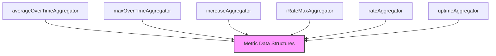

# Time Series Aggregators Module

The `time_series_aggregators` module provides a collection of concrete implementations for aggregating time-series data. These aggregators are fundamental for transforming raw metric data into meaningful insights, enabling calculations such as averages, maximums, rates, and increases over specified time windows. This module is a core component of the larger [metric_aggregation](metric_aggregation.md) system.

<!-- DIAGRAM_JSON
{
    "direction": "TD",
    "nodes": [
        {"id": "avg_aggregator", "label": "averageOverTimeAggregator", "type": "component", "link": null},
        {"id": "max_aggregator", "label": "maxOverTimeAggregator", "type": "component", "link": null},
        {"id": "increase_aggregator", "label": "increaseAggregator", "type": "component", "link": null},
        {"id": "iratemax_aggregator", "label": "iRateMaxAggregator", "type": "component", "link": null},
        {"id": "rate_aggregator", "label": "rateAggregator", "type": "component", "link": null},
        {"id": "uptime_aggregator", "label": "uptimeAggregator", "type": "component", "link": null},
        {"id": "metric_data_structures", "label": "Metric Data Structures", "type": "external", "link": "metric_data_structures.md"}
    ],
    "edges": [
        {"source": "avg_aggregator", "target": "metric_data_structures"},
        {"source": "max_aggregator", "target": "metric_data_structures"},
        {"source": "increase_aggregator", "target": "metric_data_structures"},
        {"source": "iratemax_aggregator", "target": "metric_data_structures"},
        {"source": "rate_aggregator", "target": "metric_data_structures"},
        {"source": "uptime_aggregator", "target": "metric_data_structures"}
    ],
    "groups": []
}
-->


## Purpose and Core Functionality

This module encapsulates various algorithms for aggregating time-series metrics. Each aggregator is designed to perform a specific type of calculation over a series of data points, contributing to the system's ability to process and analyze vast amounts of metric data efficiently.

The core aggregators include:

*   **`averageOverTimeAggregator`**: Calculates the average value of a metric over a defined time window.
    *   **Fields**: `lock` (mutex for concurrency), `labelValues` (metric labels), `total` (sum of values), `count` (number of values), `currentTime` (timestamp of the last observed value).

    ```go
    type averageOverTimeAggregator struct {
    	lock        sync.Mutex
    	labelValues []string
    	total       float64
    	count       int
    	currentTime *time.Time
    }
    ```

*   **`maxOverTimeAggregator`**: Determines the maximum value of a metric within a specified time period.
    *   **Fields**: `lock` (mutex for concurrency), `labelValues` (metric labels), `max` (current maximum value).

    ```go
    type maxOverTimeAggregator struct {
    	lock        sync.Mutex
    	labelValues []string
    	max         float64
    }
    ```

*   **`increaseAggregator`**: Computes the increase in a counter over time. It tracks the difference between current and previous values.
    *   **Fields**: `lock` (mutex for concurrency), `labelValues` (metric labels), `currentTime`, `previousTime` (timestamps for current and previous observations), `previous`, `current` (values at respective times), `increase` (calculated increase).

    ```go
    type increaseAggregator struct {
    	lock         sync.Mutex
    	labelValues  []string
    	currentTime  time.Time
    	previousTime time.Time
    	previous     float64
    	current      float64
    	increase     float64
    }
    ```

*   **`iRateMaxAggregator`**: Calculates the maximum instantaneous rate of change for a metric. This is particularly useful for identifying peak rates.
    *   **Fields**: `lock` (mutex for concurrency), `name` (aggregator name), `labelValues` (metric labels), `initialized` (flag for initial state), `previousTime`, `currentTime` (timestamps), `previous`, `current` (values), `max` (maximum instantaneous rate).

    ```go
    type iRateMaxAggregator struct {
    	lock         sync.Mutex
    	name         string
    	labelValues  []string
    	initialized  bool
    	previousTime time.Time
    	currentTime  time.Time
    	previous     float64
    	current      float64
    	max          float64
    }
    ```

*   **`rateAggregator`**: Computes the average rate of increase per second of a time series.
    *   **Fields**: `lock` (mutex for concurrency), `labelValues` (metric labels), `previousTime`, `previous` (previous observation), `currentTime`, `current` (current observation), `runningAvg` (calculated running average rate), `seconds` (time elapsed).

    ```go
    type rateAggregator struct {
    	lock         sync.Mutex
    	labelValues  []string
    	previousTime time.Time
    	previous     float64
    	currentTime  time.Time
    	current      float64
    	runningAvg   float64
    	seconds      float64
    }
    ```

*   **`uptimeAggregator`**: Measures the duration a system or component has been operational.
    *   **Fields**: `lock` (mutex for concurrency), `labelValues` (metric labels), `start` (start time of uptime), `end` (end time of uptime).

    ```go
    type uptimeAggregator struct {
    	lock        sync.Mutex
    	labelValues []string
    	start       *time.Time
    	end         *time.Time
    }
    ```

## Architecture and Component Relationships

The `time_series_aggregators` module is a collection of distinct, self-contained aggregator implementations. Each aggregator type (e.g., `averageOverTimeAggregator`, `maxOverTimeAggregator`) operates independently but adheres to common interfaces defined within the [metric_aggregation](metric_aggregation.md) module, specifically using data structures and types from [metric_data_structures](metric_data_structures.md).

The aggregators process raw time-series data points, typically provided by upstream data collection components, and produce aggregated metrics. The relationship is primarily one of consumption: these aggregators consume raw metric data and output processed metric data, which can then be stored or further analyzed.

## How the Module Fits into the Overall System

The `time_series_aggregators` module plays a crucial role in the system's metric pipeline by providing the computational logic for deriving higher-level metrics from raw observations. It sits within the `metric_aggregation` layer, acting as the concrete implementation for various aggregation strategies.

Data flows into these aggregators from data sources, likely through components in `metric_management` or `prometheus_integration`. Once aggregated, the resulting metrics are then typically passed to storage solutions, such as those managed by [metric_storage](metric_storage.md), or used for real-time monitoring and alerting. This module ensures that the system can generate a wide array of meaningful metrics from its collected time-series data, essential for observability, cost analysis, and performance monitoring.
