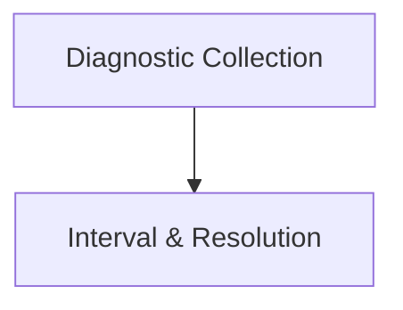

# Utilities and Diagnostics Module

## Introduction

The `utilities_diagnostics` module provides essential tools for managing time intervals, resolution configurations, and collecting operational diagnostics within the system. It ensures proper data temporal alignment and offers insights into the system's health and performance.

## Architecture

The module is structured into two main sub-modules:

- **Diagnostic Collection**: Focuses on gathering and reporting diagnostic information.
- **Interval and Resolution**: Manages time-based configurations and operations.

<!-- DIAGRAM_JSON
{
    "direction": "TD",
    "nodes": [
        {"id": "diagnostic_collection", "label": "Diagnostic Collection", "type": "module", "link": "diagnostic_collection.md"},
        {"id": "interval_and_resolution", "label": "Interval & Resolution", "type": "module", "link": "interval_and_resolution.md"}
    ],
    "edges": [
        {"source": "diagnostic_collection", "target": "interval_and_resolution"}
    ],
    "groups": []
}
-->

## Sub-modules Overview

### [Diagnostic Collection](diagnostic_collection.md)

This sub-module is responsible for defining, collecting, and managing various diagnostic insights into the system's operation. It provides interfaces and implementations for capturing operational metrics and errors, such as those related to data scraping processes.

### [Interval and Resolution](interval_and_resolution.md)

The `interval_and_resolution` sub-module handles the configuration and manipulation of time-based intervals and data resolution settings. It includes components for defining different types of intervals (e.g., weekly, duration-based) and for configuring how data should be resolved over time.
