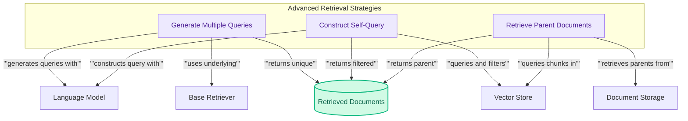

## Advanced Retrieval Strategies

This module offers advanced retrieval techniques like generating multiple queries, constructing self-queries for structured data, and retrieving parent documents from chunks to enhance search relevance.

<!-- DIAGRAM_JSON
{
    "direction": "TD",
    "nodes": [
        {
            "id": "multi_query",
            "label": "Generate Multiple Queries",
            "type": "component",
            "link": null
        },
        {
            "id": "self_query",
            "label": "Construct Self-Query",
            "type": "component",
            "link": null
        },
        {
            "id": "multi_vector",
            "label": "Retrieve Parent Documents",
            "type": "component",
            "link": null
        },
        {
            "id": "base_retriever",
            "label": "Base Retriever",
            "type": "external",
            "link": "base_and_composite_retrievers.md"
        },
        {
            "id": "vector_store",
            "label": "Vector Store",
            "type": "external",
            "link": "vector_stores.md"
        },
        {
            "id": "language_model",
            "label": "Language Model",
            "type": "external",
            "link": "models_and_embeddings.md"
        },
        {
            "id": "document_store",
            "label": "Document Storage",
            "type": "external",
            "link": "caching_and_storage.md"
        },
        {
            "id": "retrieved_docs",
            "label": "Retrieved Documents",
            "type": "data",
            "link": null
        }
    ],
    "edges": [
        {
            "source": "multi_query",
            "target": "language_model",
            "label": "generates queries with"
        },
        {
            "source": "multi_query",
            "target": "base_retriever",
            "label": "uses underlying"
        },
        {
            "source": "self_query",
            "target": "language_model",
            "label": "constructs query with"
        },
        {
            "source": "self_query",
            "target": "vector_store",
            "label": "queries and filters"
        },
        {
            "source": "multi_vector",
            "target": "vector_store",
            "label": "queries chunks in"
        },
        {
            "source": "multi_vector",
            "target": "document_store",
            "label": "retrieves parents from"
        },
        {
            "source": "multi_query",
            "target": "retrieved_docs",
            "label": "returns unique"
        },
        {
            "source": "self_query",
            "target": "retrieved_docs",
            "label": "returns filtered"
        },
        {
            "source": "multi_vector",
            "target": "retrieved_docs",
            "label": "returns parent"
        }
    ],
    "groups": [
        {
            "id": "retrieval_strategies_group",
            "label": "Advanced Retrieval Strategies",
            "role": "analytical",
            "nodes": [
                "multi_query",
                "self_query",
                "multi_vector"
            ]
        }
    ]
}
-->
