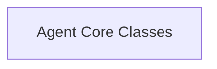

# Agent Base Classes Module

The `agent_base_classes` module provides the fundamental building blocks for constructing intelligent agents within the LangChain Classic framework. It defines the core abstract classes and common functionalities that all agents inherit, focusing on how agents plan actions, interact with language models, and parse outputs.

## Architecture Overview

The `agent_base_classes` module is structured around core abstract classes that establish the foundational interface for agents. It currently comprises one primary sub-module:

<!-- DIAGRAM_JSON
{
    "direction": "TD",
    "nodes": [
        {"id": "agent_core_classes", "label": "Agent Core Classes", "type": "module", "link": "agent_core_classes.md"}
    ],
    "edges": [],
    "groups": []
}
-->

## Sub-modules

### [Agent Core Classes](agent_core_classes.md)
This sub-module contains the foundational abstract classes, `Agent` and `LLMSingleActionAgent`, which serve as the base for all single-action agents. These classes define the essential methods for planning, executing steps, and parsing outputs from language models, allowing for consistent agent development and interaction within the system.