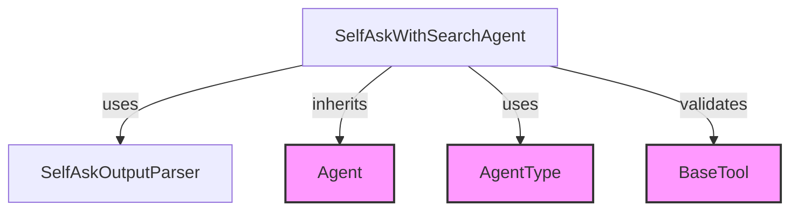

# agent_class_definition Module Documentation

## Introduction
The `agent_class_definition` module provides the core class for the Self-Ask with Search agent within the `langchain_classic` agents framework. It defines the structure and fundamental behavior of the `SelfAskWithSearchAgent`, which is designed to perform tasks by iteratively asking itself clarifying questions and using a search tool to find answers.

## Architecture and Component Relationships

The `SelfAskWithSearchAgent` class is the central component of this module. It extends the base `Agent` class and specializes its behavior for the Self-Ask with Search paradigm.

### SelfAskWithSearchAgent
The `SelfAskWithSearchAgent` is a specialized agent designed to implement the "Self-Ask with Search" reasoning process. This approach involves the agent breaking down a complex query into smaller, answerable sub-questions, using a tool to find answers to these sub-questions, and then synthesizing the information to answer the original query.

Key characteristics and relationships:
*   **Inheritance:** It inherits from the `Agent` class, leveraging its foundational agent functionalities.
*   **Output Parsing:** It utilizes a `SelfAskOutputParser` to interpret the LLM's raw output into actionable agent steps. This parser is crucial for guiding the agent's self-ask process.
*   **Agent Type:** It explicitly defines its agent type as `AgentType.SELF_ASK_WITH_SEARCH`, which helps in identifying and categorizing this specific agent implementation.
*   **Tool Requirements:** This agent has a strict requirement for exactly one tool, which *must* be named "Intermediate Answer". This tool is fundamental to its operation, as it simulates the "search" aspect of the self-ask process.
*   **Prompt Independence:** The agent's prompt template is designed to be independent of the specific tools provided, relying on a predefined `PROMPT` constant for its operational instructions.
*   **Prefixes:** It customizes the `observation_prefix` to "Intermediate answer: " and sets `llm_prefix` to an empty string, influencing how observations and LLM calls are formatted.

## How the Module Fits into the Overall System

The `agent_class_definition` module is a leaf module within the `classic_agents.specialized_agents.self_ask_with_search_agents` hierarchy. It provides the concrete implementation of the `SelfAskWithSearchAgent` class, which is a key component for enabling advanced reasoning capabilities within the LangChain Classic framework.

This agent type is utilized by other parts of the system that require a structured approach to problem-solving, particularly when external knowledge retrieval (via the "Intermediate Answer" tool) is necessary. The agent's structure allows for robust, multi-step reasoning by explicitly managing intermediate thoughts and observations.

<!-- DIAGRAM_JSON
{
    "direction": "TD",
    "nodes": [
        {"id": "self_ask_agent", "label": "SelfAskWithSearchAgent", "type": "component", "link": null},
        {"id": "output_parser", "label": "SelfAskOutputParser", "type": "component", "link": null},
        {"id": "base_agent", "label": "Agent", "type": "external", "link": "classic_agents.md"},
        {"id": "agent_type_enum", "label": "AgentType", "type": "external", "link": "agent_core.md"},
        {"id": "base_tool", "label": "BaseTool", "type": "external", "link": "core_tools.md"}
    ],
    "edges": [
        {"source": "self_ask_agent", "target": "output_parser", "label": "uses"},
        {"source": "self_ask_agent", "target": "base_agent", "label": "inherits"},
        {"source": "self_ask_agent", "target": "agent_type_enum", "label": "uses"},
        {"source": "self_ask_agent", "target": "base_tool", "label": "validates"}
    ],
    "groups": []
}
-->

