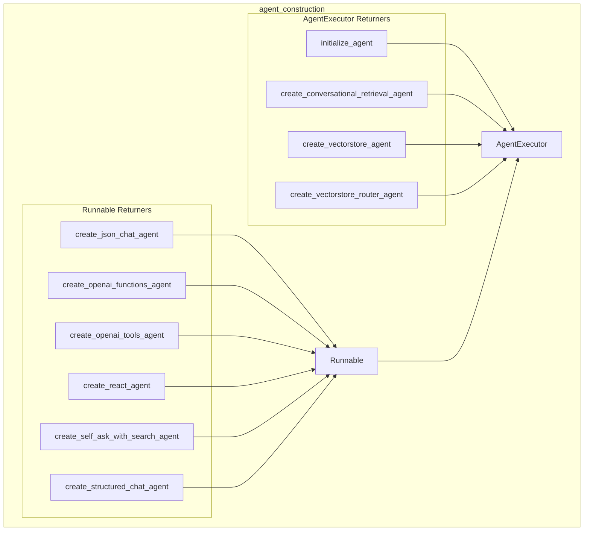

# agent_construction
This module provides a collection of factory functions for constructing various types of AI agents, including ReAct, OpenAI function/tool calling, conversational, and vector store-backed agents, all designed to be executed within an `AgentExecutor`.

<!-- DIAGRAM_JSON
{
  "nodes": [
    {"id": "initialize_agent", "label": "initialize_agent"},
    {"id": "create_conversational_retrieval_agent", "label": "create_conversational_retrieval_agent"},
    {"id": "create_vectorstore_agent", "label": "create_vectorstore_agent"},
    {"id": "create_vectorstore_router_agent", "label": "create_vectorstore_router_agent"},
    {"id": "create_json_chat_agent", "label": "create_json_chat_agent"},
    {"id": "create_openai_functions_agent", "label": "create_openai_functions_agent"},
    {"id": "create_openai_tools_agent", "label": "create_openai_tools_agent"},
    {"id": "create_react_agent", "label": "create_react_agent"},
    {"id": "create_self_ask_with_search_agent", "label": "create_self_ask_with_search_agent"},
    {"id": "create_structured_chat_agent", "label": "create_structured_chat_agent"},
    {"id": "Runnable", "label": "Runnable"},
    {"id": "AgentExecutor", "label": "AgentExecutor"}
  ],
  "edges": [
    {"source": "initialize_agent", "target": "AgentExecutor"},
    {"source": "create_conversational_retrieval_agent", "target": "AgentExecutor"},
    {"source": "create_vectorstore_agent", "target": "AgentExecutor"},
    {"source": "create_vectorstore_router_agent", "target": "AgentExecutor"},
    {"source": "create_json_chat_agent", "target": "Runnable"},
    {"source": "create_openai_functions_agent", "target": "Runnable"},
    {"source": "create_openai_tools_agent", "target": "Runnable"},
    {"source": "create_react_agent", "target": "Runnable"},
    {"source": "create_self_ask_with_search_agent", "target": "Runnable"},
    {"source": "create_structured_chat_agent", "target": "Runnable"},
    {"source": "Runnable", "target": "AgentExecutor"}
  ],
  "groups": [
    {
      "id": "agent_construction_module",
      "label": "agent_construction",
      "members": [
        "initialize_agent",
        "create_conversational_retrieval_agent",
        "create_vectorstore_agent",
        "create_vectorstore_router_agent",
        "create_json_chat_agent",
        "create_openai_functions_agent",
        "create_openai_tools_agent",
        "create_react_agent",
        "create_self_ask_with_search_agent",
        "create_structured_chat_agent",
        "Runnable",
        "AgentExecutor"
      ]
    },
    {
      "id": "AgentExecutor_Returners_group",
      "label": "AgentExecutor Returners",
      "members": [
        "initialize_agent",
        "create_conversational_retrieval_agent",
        "create_vectorstore_agent",
        "create_vectorstore_router_agent"
      ],
      "parent": "agent_construction_module"
    },
    {
      "id": "Runnable_Returners_group",
      "label": "Runnable Returners",
      "members": [
        "create_json_chat_agent",
        "create_openai_functions_agent",
        "create_openai_tools_agent",
        "create_react_agent",
        "create_self_ask_with_search_agent",
        "create_structured_chat_agent"
      ],
      "parent": "agent_construction_module"
    }
  ]
}
-->
