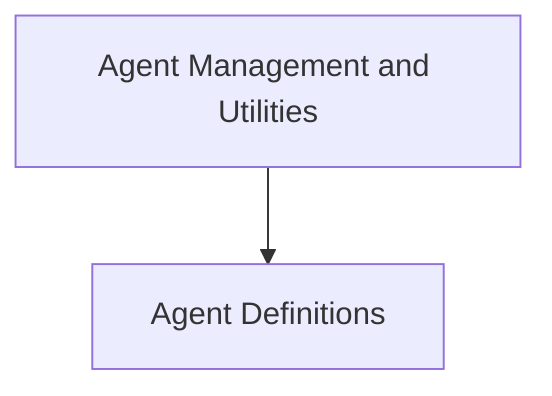

# Agent Core Module

## Introduction

The `agent_core` module serves as the foundational layer for managing and interacting with agents within the classic LangChain framework. It defines the basic structure of agents, handles their initialization, enumerates available agent types, and includes utilities for deprecation warnings. This module is crucial for understanding how agents are constructed, planned, and executed in the classic LangChain architecture.

## Architecture Overview

The `agent_core` module is composed of several key sub-modules that work together to provide a robust agent framework.

<!-- DIAGRAM_JSON
{
    "direction": "TD",
    "nodes": [
        {"id": "agent_definitions", "label": "Agent Definitions", "type": "module", "link": "agent_definitions.md"},
        {"id": "agent_management", "label": "Agent Management and Utilities", "type": "module", "link": "agent_management.md"}
    ],
    "edges": [
        {"source": "agent_management", "target": "agent_definitions"}
    ],
    "groups": []
}
-->

## Sub-modules

### [Agent Definitions](agent_definitions.md)

This sub-module contains the fundamental classes for defining agents. It includes abstract base classes such as `Agent` and `LLMSingleActionAgent`, which outline the core planning and execution logic for different agent behaviors.

### [Agent Management and Utilities](agent_management.md)

This sub-module is responsible for the overall management of agents. It provides mechanisms for initializing agents from configurations, enumerating various `AgentType`s, and handling internal deprecation warnings through `__getattr__` to guide developers towards updated practices.
